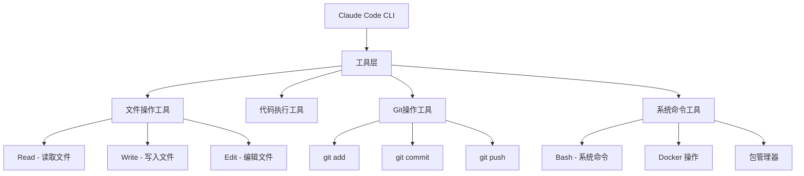
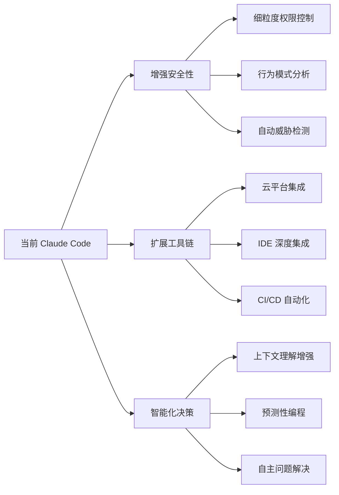

# Claude Code 设计哲学：为什么 AI 需要本地文件操作能力？

## 前言

很多人在第一次使用 Claude Code 时会有疑问：为什么一个 AI 助手可以直接修改我的本地文件？为什么它能执行 Git 操作？这不是很危险吗？

这篇文章将深入解析 Claude Code 的设计哲学，帮你理解这些能力背后的技术考量和安全机制。

## 🛠️ Claude Code 的工具架构

### 工具权限体系

Claude Code 通过一系列专门的工具来与本地系统交互：



### 预批准命令系统

Claude Code 有一个重要的安全机制 - **预批准命令列表**：

```yaml
# 用户可以预先批准的"安全"命令
预批准命令:
  Git操作:
    - git add -A
    - git commit -m "..."
    - git push

  构建工具:
    - npm install
    - ./mvnw compile
    - mvn clean compile

  容器操作:
    - docker-compose up -d
    - docker build

  开发服务:
    - npm run dev
    - python manage.py runserver
```

当我执行这些操作时，系统会检查是否在预批准列表中，如果在，就可以直接执行而无需用户确认。

## 🔒 安全边界设计

### 明确的权限范围

```text
✅ Claude Code 可以做什么：
- 读取和修改项目文件
- 执行预批准的构建/测试命令
- Git 操作（add/commit/push）
- 安装依赖包
- 运行开发服务器
- 创建和编辑配置文件

❌ Claude Code 不能做什么：
- 访问系统敏感文件（如 /etc/passwd）
- 执行危险命令（如 rm -rf /）
- 访问网络上的任意资源
- 修改系统配置
- 访问其他用户的文件
- 安装系统级软件
```

### 工作目录隔离

Claude Code 主要在**当前工作目录**及其子目录中操作，这提供了一个天然的安全沙箱：

```bash
# Claude Code 的工作范围
/Users/username/my-project/     # ✅ 当前项目目录
├── src/                        # ✅ 可以访问
├── package.json               # ✅ 可以修改
├── .git/                      # ✅ 可以操作
└── node_modules/              # ✅ 可以管理

/Users/username/other-project/  # ❌ 其他项目目录
/etc/                          # ❌ 系统配置目录
/home/                         # ❌ 其他用户目录
```

## 🎯 为什么需要这些能力？

### 传统 AI vs Claude Code 的差异

```text
传统 AI 聊天 vs Claude Code:

❌ 传统方式：
Human: 我需要实现一个登录功能
AI: 这是登录组件的代码，请复制粘贴到 LoginComponent.js
Human: [手动复制] → [手动粘贴] → [手动保存] → [手动 git add] → [手动 commit]

✅ Claude Code 方式：
Human: 我需要实现一个登录功能
AI: 我来直接为你创建登录组件，包括路由配置和样式
Result: 自动创建文件、配置路由、提交代码，整个流程一气呵成
```

### 端到端的开发体验

Claude Code 的目标是提供**完整的编程工作流**：


### 减少认知负载

```python
# 传统开发流程的认知负载：
cognitive_load = {
    'context_switching': '在 AI 建议和编辑器间切换',
    'manual_operations': '大量重复的文件操作',
    'workflow_interruption': '频繁中断开发思路',
    'error_prone': '复制粘贴容易出错'
}

# Claude Code 简化后的流程：
simplified_workflow = {
    'focus_on_logic': '专注业务逻辑思考',
    'automated_execution': 'AI 自动执行重复操作',
    'continuous_flow': '保持开发思路连贯',
    'error_reduction': '减少手动操作错误'
}
```

## ⚠️ 风险识别与防护

### 潜在风险分析

```text
🚨 可能的风险：

1. 文件安全风险
   - 意外覆盖重要文件
   - 删除关键代码
   - 修改配置导致系统异常

2. 代码质量风险
   - 提交不当的代码更改
   - 引入安全漏洞
   - 破坏代码架构

3. 操作风险
   - 执行错误的系统命令
   - 误删数据库数据
   - 暴露敏感信息

4. 依赖风险
   - 安装恶意包
   - 版本冲突
   - 许可证问题
```

### 多层防护机制

```text
🛡️ 安全防护体系：

第一层：工具权限限制
┌─────────────────────────────────┐
│ • 只能访问预定义的工具            │
│ • 文件操作限制在项目目录          │
│ • 网络访问受限                  │
│ • 系统命令白名单机制             │
└─────────────────────────────────┘

第二层：预批准命令系统
┌─────────────────────────────────┐
│ • 危险命令需要用户确认            │
│ • 常见安全命令可预批准            │
│ • 命令参数验证                  │
│ • 执行日志记录                  │
└─────────────────────────────────┘

第三层：用户控制
┌─────────────────────────────────┐
│ • 用户可以随时中断操作            │
│ • 关键操作会有确认提示            │
│ • 实时显示操作进度              │
│ • 支持回滚功能                  │
└─────────────────────────────────┘

第四层：版本控制保护
┌─────────────────────────────────┐
│ • 所有更改都有 Git 历史记录       │
│ • 可以轻松回滚错误操作           │
│ • 分支保护机制                  │
│ • 变更审查流程                  │
└─────────────────────────────────┘
```

## 🎨 设计哲学演进

### AI 角色的演变

```text
第一代 AI：信息检索器
┌─────────────────┐
│ Human: 问题      │
│ AI: 答案        │
│ Human: 手动操作  │
└─────────────────┘

第二代 AI：建议提供者
┌─────────────────┐
│ Human: 需求      │
│ AI: 代码建议     │
│ Human: 复制粘贴  │
└─────────────────┘

第三代 AI：协作执行者 (Claude Code)
┌─────────────────┐
│ Human: 意图      │
│ AI: 理解+执行    │
│ Result: 完成     │
└─────────────────┘

未来 AI：自主开发者
┌─────────────────┐
│ Human: 目标      │
│ AI: 端到端交付   │
│ Result: 产品     │
└─────────────────┘
```

### 从工具到伙伴的转变

```typescript
// 传统开发模式
interface TraditionalDevelopment {
  developer: Human;
  tools: IDE | Terminal | Browser;
  ai: ConsultantRole; // 仅提供建议

  workflow: [
    'think' → 'search_stackoverflow' → 'copy_code' →
    'modify' → 'test' → 'debug' → 'commit'
  ];
}

// Claude Code 模式
interface ClaudeCodeDevelopment {
  team: [Human, ClaudeCode];
  shared_workspace: ProjectDirectory;
  ai: CollaboratorRole; // 直接参与开发

  workflow: [
    'discuss' → 'implement_together' → 'validate' → 'deploy'
  ];
}
```

## 🛠️ 实际应用场景

### 场景一：快速原型开发

```bash
# 传统方式（15-20分钟）
mkdir my-app
cd my-app
npm init -y
# [手动编辑 package.json]
npm install express cors helmet
# [手动创建 app.js]
# [手动编写服务器代码]
# [手动创建路由文件]
# [手动测试]
git init
git add .
git commit -m "Initial commit"

# Claude Code 方式（2-3分钟）
claude: "创建一个Express API服务，包含用户认证和CRUD操作"
# 自动完成所有上述步骤 + 错误处理 + 文档
```

### 场景二：复杂重构

```typescript
// 需要重构的复杂操作
const refactoringTask = {
  scope: '将 JavaScript 项目迁移到 TypeScript',
  files: 50+,
  dependencies: ['类型定义', '配置文件', '构建脚本'],

  // 传统方式需要：
  manual_steps: [
    '逐个文件添加类型',
    '安装类型依赖',
    '配置 tsconfig.json',
    '修改构建脚本',
    '处理类型错误',
    '更新文档'
  ],

  // Claude Code 方式：
  claude_workflow: [
    '分析项目结构',
    '自动添加类型注解',
    '配置 TypeScript',
    '更新构建流程',
    '修复类型错误',
    '提交分阶段更改'
  ]
};
```

### 场景三：DevOps 自动化

```yaml
# Claude Code 自动化 DevOps 流程
automation_example:
  trigger: "用户请求：部署到生产环境"

  actions:
    - analyze_changes: "检查代码变更"
    - run_tests: "执行完整测试套件"
    - build_image: "构建 Docker 镜像"
    - update_config: "更新 Kubernetes 配置"
    - deploy: "执行滚动升级"
    - verify: "验证部署状态"
    - notify: "发送部署报告"

  safety_checks:
    - rollback_plan: "自动回滚机制"
    - health_monitoring: "健康检查"
    - approval_gates: "关键步骤确认"
```

## 📋 最佳实践指南

### 安全使用建议

```bash
# 🎯 安全使用 Claude Code 的最佳实践：

# 1. 版本控制保护
git init  # 确保项目有版本控制
git remote add origin <your-repo>  # 设置远程仓库

# 2. 敏感信息保护
echo "*.env" >> .gitignore
echo ".secrets/" >> .gitignore
echo "config/production.json" >> .gitignore

# 3. 分支策略
git checkout -b claude-experiment  # 在分支中实验
# 测试完成后再合并到主分支

# 4. 定期备份
git push origin main  # 定期推送到远程仓库

# 5. 审查机制
git diff  # 查看具体修改
git log --oneline  # 检查提交历史
```

### 权限配置建议

```yaml
# claude-config.yaml - 推荐的权限配置
security_settings:
  # 允许的文件操作
  file_operations:
    read: ["src/**", "*.md", "package.json"]
    write: ["src/**", "docs/**"]
    exclude: [".env", "*.key", "*.pem"]

  # 允许的命令
  allowed_commands:
    safe: ["npm install", "npm test", "git add", "git commit"]
    requires_confirmation: ["git push", "docker build"]
    forbidden: ["rm -rf", "sudo", "curl | sh"]

  # 网络访问限制
  network_access:
    allowed_domains: ["api.github.com", "registry.npmjs.org"]
    blocked_domains: ["*"]
```

### 团队协作建议

```typescript
interface TeamWorkflow {
  // 个人开发环境
  individual: {
    claude_code: 'full_access',
    scope: 'feature_branches',
    review: 'self_review'
  };

  // 团队共享环境
  team: {
    claude_code: 'limited_access',
    scope: 'main_branch',
    review: 'peer_review'
  };

  // 生产环境
  production: {
    claude_code: 'read_only',
    scope: 'monitoring_only',
    review: 'mandatory_approval'
  };
}
```

## 🔮 未来展望

### AI 开发工具的演进趋势

```text
当前阶段：AI 协作编程
┌─────────────────────────────────┐
│ • 代码生成和修改                │
│ • 自动化重复任务                │
│ • 智能错误修复                  │
│ • 文档自动生成                  │
└─────────────────────────────────┘

近期未来：AI 项目管理
┌─────────────────────────────────┐
│ • 自动化项目规划                │
│ • 智能资源分配                  │
│ • 预测性维护                    │
│ • 自动化测试策略                │
└─────────────────────────────────┘

远期愿景：AI 产品交付
┌─────────────────────────────────┐
│ • 端到端产品开发                │
│ • 自动化业务分析                │
│ • 智能架构设计                  │
│ • 全生命周期管理                │
└─────────────────────────────────┘
```

### 技术发展方向



## 🎯 总结

Claude Code 拥有本地文件操作和Git能力的核心原因：

### 🚀 **效率革命**
- 消除重复性手工操作
- 减少上下文切换
- 提升开发流程连贯性

### 🤖 **AI 协作新范式**
- 从"建议者"到"执行者"
- 真正的编程伙伴关系
- 智能化工作流自动化

### 🛡️ **安全设计**
- 多层防护机制
- 权限最小化原则
- 用户始终保持控制权

### 🎨 **设计哲学**
- 以开发者体验为中心
- 平衡功能性与安全性
- 面向未来的可扩展架构

**核心理念**：让 AI 在确保安全的前提下，真正参与到编程工作流中，成为开发者的智能伙伴，而不仅仅是一个代码生成工具。

这种设计代表了 AI 工具发展的重要方向：从**被动响应**转向**主动协作**，从**辅助工具**演进为**智能伙伴**。

---

*Claude Code 的每一个设计决策都体现了对开发者需求的深度理解和对未来 AI 协作模式的前瞻思考。在这个 AI 与人类协作的新时代，安全性和实用性的平衡将是所有 AI 工具都需要面对的核心挑战。*