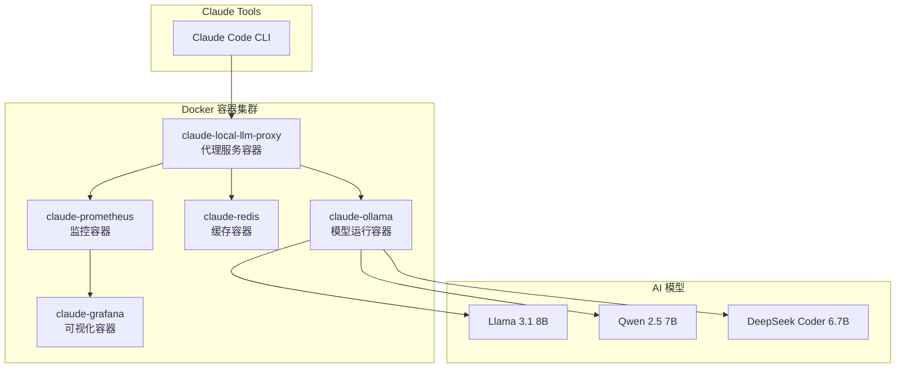

# 🐳 Docker 部署完整指南

本指南详细介绍如何使用Docker容器化部署Claude Tools + 本地大模型集成系统。

## 🎯 部署概览

### 系统架构


### 核心优势
- 🚀 **一键部署**: 一条命令启动完整AI工具链
- 🔄 **零配置**: 预配置优化，开箱即用
- 📊 **完整监控**: Prometheus + Grafana 监控栈
- 🔧 **自动扩容**: 基于负载自动调整资源

## 📋 系统要求

### 最低配置
- **Docker Desktop**: 4.20+
- **内存**: 8GB（推荐16GB+）
- **存储**: 20GB可用空间
- **平台**: Mac M1/M2、Linux x86_64、Windows WSL2

### 推荐配置
- **内存**: 16GB+
- **存储**: 50GB+ SSD
- **网络**: 稳定的互联网连接（首次下载模型）

## ⚡ 快速部署

### 方式1: 预构建镜像部署（推荐）

```bash
# 1. 创建项目目录
mkdir claude-local-llm && cd claude-local-llm

# 2. 下载配置文件
curl -O https://raw.githubusercontent.com/youweichen0208/YC-Tech-Blog/master/src/ai-tools/code/docker-compose.yml

# 3. 创建数据目录
mkdir -p data/ollama logs config

# 4. 一键启动所有服务
docker compose up -d

# 5. 查看启动状态
docker compose ps
```

### 方式2: 从源码构建

```bash
# 1. 克隆项目
git clone https://github.com/youweichen0208/YC-Tech-Blog.git
cd YC-Tech-Blog/src/ai-tools/code

# 2. 构建并启动
docker compose up -d --build

# 3. 等待模型下载（首次约10-15分钟）
docker compose logs -f claude-ollama
```

## 📊 部署验证

### 1. 容器状态检查
```bash
# 查看所有容器状态
docker compose ps

# 期望输出：所有服务都是 "Up" 状态
# NAME                    IMAGE                 STATUS
# claude-local-llm-proxy  local-llm-proxy       Up 2 minutes (healthy)
# claude-ollama           ollama/ollama:latest  Up 3 minutes (healthy)
# claude-redis            redis:7-alpine        Up 3 minutes (healthy)
# claude-prometheus       prom/prometheus       Up 2 minutes (healthy)
# claude-grafana          grafana/grafana       Up 1 minute (healthy)
```

### 2. 服务健康检查
```bash
# API服务健康检查
curl http://localhost:8000/health

# 期望输出
{
  "status": "healthy",
  "claude_tools_ready": true,
  "ollama_connected": true,
  "models_loaded": ["llama3.1:8b", "qwen2.5:7b", "deepseek-coder:6.7b"]
}
```

### 3. 功能验证测试
```bash
# 测试智能路由
curl -X POST http://localhost:8000/api/generate \
  -H "Content-Type: application/json" \
  -d '{
    "prompt": "写一个Python冒泡排序算法",
    "task_type": "code",
    "temperature": 0.2
  }'

# 测试Claude Tools集成
curl -X POST http://localhost:8000/claude-tools/code-review \
  -H "Content-Type: application/json" \
  -d '{
    "code": "def hello():\n    print(\"Hello World\")",
    "language": "python"
  }'
```

## 🎛️ 高级配置

### 环境变量配置

创建 `.env` 文件：
```bash
# 创建环境配置文件
cat > .env << 'EOF'
# 基础配置
OLLAMA_NUM_PARALLEL=2
OLLAMA_MAX_LOADED_MODELS=3
PROXY_WORKERS=4

# Claude Tools配置
CLAUDE_TOOLS_ENABLED=true
CORS_ORIGINS=*

# 监控配置
PROMETHEUS_ENABLED=true
GRAFANA_ADMIN_PASSWORD=claude123

# 性能优化
REDIS_MAX_MEMORY=512mb
OLLAMA_FLASH_ATTENTION=1
EOF
```

### 资源限制配置

```yaml
# docker-compose.override.yml
version: '3.8'
services:
  claude-ollama:
    deploy:
      resources:
        limits:
          memory: 8G      # 根据你的内存调整
          cpus: '4.0'     # 根据你的CPU调整
        reservations:
          memory: 4G
          cpus: '2.0'

  claude-local-llm-proxy:
    deploy:
      resources:
        limits:
          memory: 2G
          cpus: '2.0'
```

### GPU支持配置（NVIDIA）

```yaml
# docker-compose.gpu.yml
version: '3.8'
services:
  claude-ollama:
    image: ollama/ollama:latest
    deploy:
      resources:
        reservations:
          devices:
            - driver: nvidia
              count: 1
              capabilities: [gpu]
    environment:
      - NVIDIA_VISIBLE_DEVICES=all
```

使用GPU配置：
```bash
docker compose -f docker-compose.yml -f docker-compose.gpu.yml up -d
```

## 📈 监控和运维

### 访问监控面板

| 服务 | 地址 | 用户名/密码 | 用途 |
|------|------|------------|------|
| API文档 | http://localhost:8000/docs | - | API接口文档 |
| Prometheus | http://localhost:9090 | - | 监控数据收集 |
| Grafana | http://localhost:3000 | admin/claude123 | 可视化仪表板 |
| Redis | localhost:6379 | - | 缓存状态 |

### 常用运维命令

```bash
# 查看日志
docker compose logs -f claude-local-llm-proxy
docker compose logs -f claude-ollama

# 重启服务
docker compose restart claude-local-llm-proxy

# 更新镜像
docker compose pull
docker compose up -d

# 备份数据
docker run --rm -v claude-local-llm_ollama_data:/data -v $(pwd):/backup alpine tar czf /backup/ollama-backup.tar.gz -C /data .

# 恢复数据
docker run --rm -v claude-local-llm_ollama_data:/data -v $(pwd):/backup alpine tar xzf /backup/ollama-backup.tar.gz -C /data
```

### 性能监控指标

**关键指标**：
- 响应时间 (avg: 2-5秒)
- 并发请求数 (max: 4个)
- 内存使用率 (ollama: <8GB)
- CPU使用率 (peak: <80%)
- 模型切换时间 (<30秒)

**告警阈值**：
```yaml
# Prometheus告警规则示例
- alert: HighResponseTime
  expr: histogram_quantile(0.95, rate(http_request_duration_seconds_bucket[5m])) > 10
  labels:
    severity: warning
  annotations:
    summary: "响应时间过高"

- alert: HighMemoryUsage
  expr: container_memory_usage_bytes{name="claude-ollama"} / container_spec_memory_limit_bytes > 0.9
  labels:
    severity: critical
  annotations:
    summary: "内存使用率过高"
```

## 🔧 故障排查

### 常见问题及解决方案

#### 1. 容器启动失败

**症状**: 容器状态显示 "Exited"

**排查步骤**:
```bash
# 查看容器日志
docker compose logs claude-ollama

# 检查端口占用
lsof -i :11434
lsof -i :8000

# 检查磁盘空间
df -h

# 解决方案
docker compose down
docker system prune -f
docker compose up -d
```

#### 2. 模型下载失败

**症状**: Ollama容器日志显示下载错误

**解决方案**:
```bash
# 手动下载模型
docker compose exec claude-ollama ollama pull llama3.1:8b
docker compose exec claude-ollama ollama pull qwen2.5:7b

# 或使用国内镜像
export OLLAMA_ORIGINS="*"
export OLLAMA_MODELS="/models"
```

#### 3. API响应超时

**症状**: curl请求超时或502错误

**排查步骤**:
```bash
# 检查代理服务状态
curl http://localhost:8000/health

# 检查Ollama连接
curl http://localhost:11434/api/tags

# 查看资源使用情况
docker stats

# 解决方案：增加超时时间
# 在docker-compose.yml中添加：
environment:
  - REQUEST_TIMEOUT=120
```

#### 4. 内存不足

**症状**: 系统卡顿，容器被OOM杀死

**解决方案**:
```bash
# 使用量化模型
docker compose exec claude-ollama ollama pull llama3.1:8b-q4_0

# 限制并发数
export OLLAMA_NUM_PARALLEL=1

# 调整Docker内存限制
# 在Docker Desktop设置中增加内存分配
```

## 🚀 生产环境部署

### 安全配置

```yaml
# docker-compose.prod.yml
version: '3.8'
services:
  claude-local-llm-proxy:
    environment:
      - CORS_ORIGINS=https://yourdomain.com
      - API_KEY_REQUIRED=true
      - RATE_LIMIT_ENABLED=true
    restart: always

  claude-grafana:
    environment:
      - GF_SECURITY_ADMIN_PASSWORD=${GRAFANA_PASSWORD}
      - GF_USERS_ALLOW_SIGN_UP=false
      - GF_AUTH_ANONYMOUS_ENABLED=false
```

### 反向代理配置（Nginx）

```nginx
# /etc/nginx/sites-available/claude-llm
server {
    listen 80;
    server_name your-domain.com;

    location / {
        proxy_pass http://localhost:8000;
        proxy_set_header Host $host;
        proxy_set_header X-Real-IP $remote_addr;
        proxy_set_header X-Forwarded-For $proxy_add_x_forwarded_for;
        proxy_timeout 300s;
    }
}
```

### 自动化部署脚本

```bash
#!/bin/bash
# deploy-prod.sh

set -e

echo "🚀 开始生产环境部署..."

# 检查系统资源
if [ $(free -g | awk '/^Mem:/{print $2}') -lt 16 ]; then
    echo "⚠️  警告：内存不足16GB，可能影响性能"
fi

# 拉取最新代码
git pull origin master

# 停止旧服务
docker compose -f docker-compose.yml -f docker-compose.prod.yml down

# 更新镜像
docker compose -f docker-compose.yml -f docker-compose.prod.yml pull

# 启动服务
docker compose -f docker-compose.yml -f docker-compose.prod.yml up -d

# 等待服务启动
sleep 30

# 健康检查
if curl -f http://localhost:8000/health >/dev/null 2>&1; then
    echo "✅ 部署成功！"
else
    echo "❌ 部署失败，正在回滚..."
    docker compose -f docker-compose.yml -f docker-compose.prod.yml logs
    exit 1
fi
```

## 🔄 更新和维护

### 定期维护任务

```bash
# 每日维护脚本
#!/bin/bash
# daily-maintenance.sh

# 清理未使用的Docker资源
docker system prune -f

# 备份重要数据
docker run --rm -v claude-local-llm_ollama_data:/data -v /backup:/backup alpine tar czf /backup/ollama-$(date +%Y%m%d).tar.gz -C /data .

# 检查磁盘空间
df -h | grep -E "(80%|90%|100%)" && echo "⚠️ 磁盘空间不足"

# 重启服务（如果需要）
if [ "$(date +%u)" -eq 7 ]; then  # 每周日重启
    docker compose restart
fi
```

### 版本更新流程

```bash
# 1. 备份当前版本
docker compose down
cp docker-compose.yml docker-compose.yml.backup

# 2. 更新配置文件
curl -O https://raw.githubusercontent.com/youweichen0208/YC-Tech-Blog/master/src/ai-tools/code/docker-compose.yml

# 3. 检查配置差异
diff docker-compose.yml.backup docker-compose.yml

# 4. 渐进式更新
docker compose pull
docker compose up -d --no-deps claude-local-llm-proxy
sleep 10
docker compose up -d

# 5. 验证更新
curl http://localhost:8000/health
```

## 📚 相关文档

- [🏗️ 系统架构详解](LOCAL_LLM_ARCHITECTURE.md)
- [⚡ 快速开始指南](QUICKSTART.md)
- [💻 代码总览](CODE_OVERVIEW.md)

---

*Docker部署方式为Claude Tools + 本地大模型提供了企业级的稳定性和可扩展性，是推荐的生产环境部署方案。*