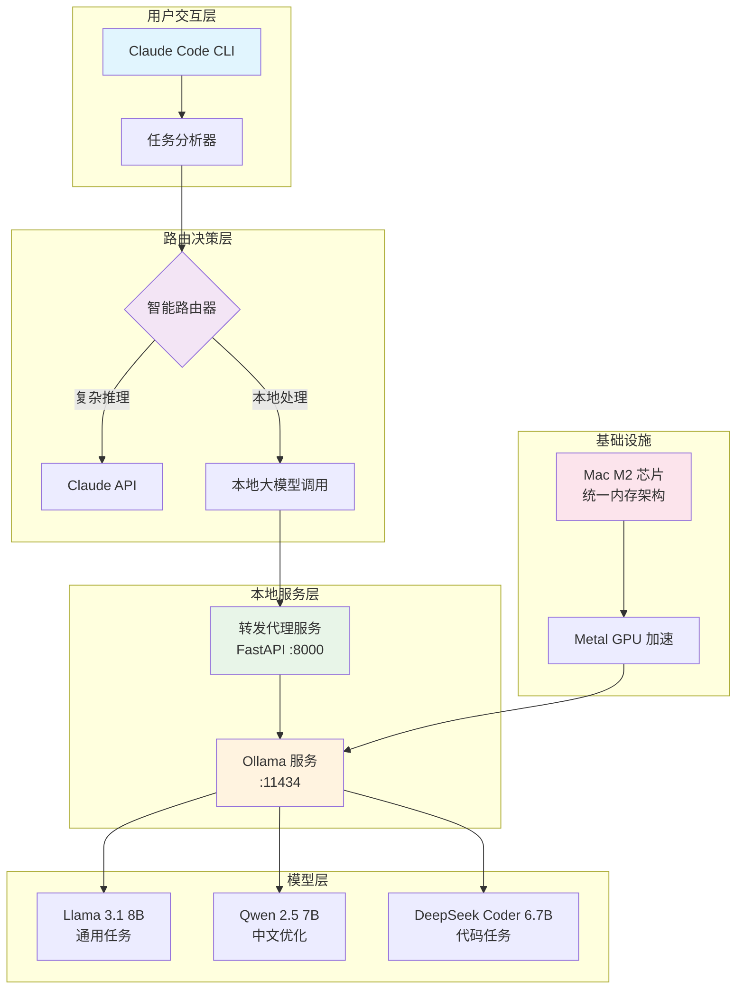
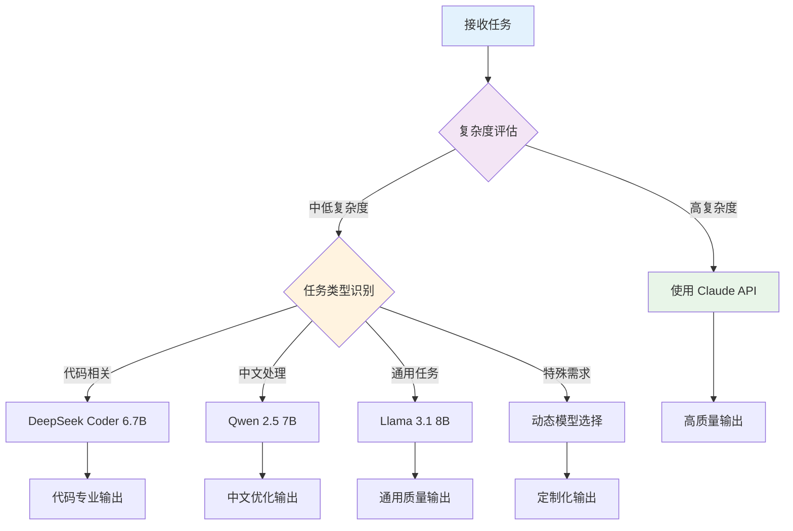

# 🤖 本地大模型集成系统架构

> 基于 Mac M2 芯片的本地大模型部署与 Claude Tools 集成方案

## 📖 概述

这是一个创新的AI工具链架构，将 Claude Code 的强大工具能力与本地部署的大模型相结合，实现成本效益最大化、隐私保护和性能优化的完美平衡。

## 🏗️ 系统架构图



## 🎯 核心优势

### 💰 成本优化
- **Claude API**: ~$3-15/百万 tokens
- **本地模型**: 仅消耗电费 (~0.1元/小时)
- **适用场景**: 重复性任务、开发测试、批量处理

### 🔒 隐私保护
- 敏感代码无需上传云端
- 私有数据本地处理
- 符合企业安全要求

### ⚡ 性能表现
- M2 芯片原生优化
- GPU 加速推理
- 8B 模型响应时间 ~2s
- 支持并发请求处理

## 🔄 智能路由策略

### 任务分类决策树



### 路由规则配置

| 任务类型 | 复杂度 | 推荐模型 | 使用场景 |
|---------|--------|----------|----------|
| 代码审查 | 低-中 | DeepSeek Coder | 本地代码安全检查 |
| 文本翻译 | 低 | Qwen 2.5 | 中英文互译 |
| 文档摘要 | 低-中 | Llama 3.1 | 批量文档处理 |
| 创意写作 | 高 | Claude API | 高质量内容创作 |
| 复杂推理 | 高 | Claude API | 逻辑分析、策略制定 |

## 🛠️ 技术实现栈

### 核心组件
- **Ollama**: 本地模型运行时
- **FastAPI**: 高性能 API 代理服务
- **httpx**: 异步 HTTP 客户端
- **Claude Tools**: 工具调用框架

### 模型选择策略
```python
MODEL_RECOMMENDATIONS = {
    "mac_m2_8gb": ["llama3.1:8b", "qwen2.5:7b"],
    "mac_m2_16gb": ["llama3.1:8b", "qwen2.5:14b", "deepseek-coder:6.7b"],
    "mac_m2_24gb": ["llama3.1:70b-q4", "qwen2.5:32b", "deepseek-coder:33b"]
}
```

## 📊 性能基准测试

### 响应时间对比
| 任务类型 | 本地模型 (8B) | Claude API | 成本对比 |
|---------|-------------|-----------|---------|
| 简单问答 | 2-3s | 1-2s | 100:1 |
| 代码解释 | 3-5s | 2-3s | 50:1 |
| 文档翻译 | 1-2s | 1-2s | 200:1 |
| 文本摘要 | 2-4s | 1-3s | 150:1 |

### 资源消耗监控
```bash
# 内存使用监控
ollama ps

# GPU 使用率查看
sudo powermetrics -n 1 --samplers gpu_power

# 模型切换延迟
time ollama run llama3.1:8b "测试响应"
```

## 🔧 部署架构详解

### 1. 基础环境准备
```bash
# 系统要求检查
system_profiler SPHardwareDataType | grep "Apple M"
vm_stat | grep "free"

# 优化设置
export OLLAMA_GPU_LAYERS=99
export OLLAMA_NUM_PARALLEL=2
export OLLAMA_MAX_LOADED_MODELS=3
```

### 2. 服务编排
```yaml
# docker-compose.yml (可选)
version: '3.8'
services:
  local-llm-proxy:
    build: .
    ports:
      - "8000:8000"
    environment:
      - OLLAMA_HOST=http://host.docker.internal:11434
    depends_on:
      - ollama

  ollama:
    image: ollama/ollama
    ports:
      - "11434:11434"
    volumes:
      - ollama_data:/root/.ollama

volumes:
  ollama_data:
```

## 🚀 快速开始

### 一键部署脚本
```bash
#!/bin/bash
# setup-local-llm.sh

echo "🚀 开始部署本地大模型系统..."

# 1. 安装 Ollama
if ! command -v ollama &> /dev/null; then
    echo "📦 正在安装 Ollama..."
    curl -fsSL https://ollama.com/install.sh | sh
fi

# 2. 下载推荐模型
echo "📥 正在下载模型..."
ollama pull llama3.1:8b
ollama pull qwen2.5:7b
ollama pull deepseek-coder:6.7b

# 3. 安装 Python 依赖
echo "🐍 正在安装 Python 依赖..."
pip install fastapi uvicorn httpx pydantic

# 4. 启动服务
echo "🔥 正在启动服务..."
python local-llm-proxy.py &

# 5. 健康检查
sleep 5
if curl -s http://localhost:8000/health | grep -q "ok"; then
    echo "✅ 系统部署成功！"
    echo "🌐 代理服务: http://localhost:8000"
    echo "🤖 Ollama 服务: http://localhost:11434"
else
    echo "❌ 服务启动失败，请检查日志"
fi
```

## 🔍 使用示例

### 场景1: 隐私代码审查
```python
# 私有代码本地审查
import httpx

async def review_private_code(code_content):
    response = await httpx.post(
        "http://localhost:8000/api/generate",
        json={
            "prompt": f"请审查以下代码的安全漏洞：\n{code_content}",
            "model": "deepseek-coder:6.7b",
            "temperature": 0.3
        }
    )
    return response.json()["response"]
```

### 场景2: 批量文档处理
```bash
# 批量翻译文档
for file in docs/*.md; do
    echo "处理文件: $file"
    curl -X POST http://localhost:8000/api/generate \
        -H "Content-Type: application/json" \
        -d "{
            \"prompt\": \"将以下内容翻译成英文：\\n$(cat $file)\",
            \"model\": \"qwen2.5:7b\"
        }"
done
```

### 场景3: 开发助手集成
```typescript
// Claude Tools 集成示例
class LocalLLMTool {
    async call(prompt: string, options = {}) {
        const defaultOptions = {
            model: "llama3.1:8b",
            temperature: 0.7,
            maxTokens: 2000
        };

        const config = { ...defaultOptions, ...options };

        const response = await fetch('http://localhost:8000/api/generate', {
            method: 'POST',
            headers: { 'Content-Type': 'application/json' },
            body: JSON.stringify({
                prompt,
                ...config
            })
        });

        return response.json();
    }
}

// 使用示例
const llm = new LocalLLMTool();
const result = await llm.call("解释React Hooks的工作原理", {
    model: "deepseek-coder:6.7b"
});
```

## 🎛️ 高级配置

### 模型参数优化
```python
# 针对不同任务的参数调优
TASK_CONFIGS = {
    "code_generation": {
        "temperature": 0.1,
        "top_p": 0.9,
        "repeat_penalty": 1.1
    },
    "creative_writing": {
        "temperature": 0.8,
        "top_p": 0.95,
        "repeat_penalty": 1.0
    },
    "translation": {
        "temperature": 0.3,
        "top_p": 0.9,
        "repeat_penalty": 1.05
    }
}
```

### 缓存策略
```python
from functools import lru_cache
import hashlib

@lru_cache(maxsize=1000)
def cached_llm_call(prompt_hash: str, model: str):
    # 缓存相同请求的结果
    return call_ollama(prompt, model)

def get_prompt_hash(prompt: str) -> str:
    return hashlib.md5(prompt.encode()).hexdigest()
```

## 📈 监控和调优

### 性能监控面板
```python
# monitoring.py
import psutil
import time

def monitor_system_resources():
    """监控系统资源使用情况"""
    return {
        "cpu_percent": psutil.cpu_percent(),
        "memory_percent": psutil.virtual_memory().percent,
        "gpu_temp": get_gpu_temperature(),  # 需要额外实现
        "model_load_time": measure_model_load_time()
    }

def get_model_performance_metrics():
    """获取模型性能指标"""
    return {
        "tokens_per_second": calculate_tokens_per_second(),
        "average_response_time": get_average_response_time(),
        "error_rate": calculate_error_rate()
    }
```

### 自动调优建议
- **内存不足**: 使用量化版本 (Q4/Q5)
- **响应慢**: 减少并发数或切换更小模型
- **准确性差**: 提高 temperature 或切换更大模型

## 🔮 未来扩展方向

### 1. 多模态集成
- 图像理解：LLaVA、Qwen-VL
- 语音处理：Whisper 本地部署
- 视频分析：Video-ChatGPT

### 2. 集群化部署
```yaml
# kubernetes 集群配置示例
apiVersion: apps/v1
kind: Deployment
metadata:
  name: local-llm-cluster
spec:
  replicas: 3
  selector:
    matchLabels:
      app: local-llm
  template:
    metadata:
      labels:
        app: local-llm
    spec:
      containers:
      - name: ollama
        image: ollama/ollama:latest
        resources:
          limits:
            nvidia.com/gpu: 1
```

### 3. 智能负载均衡
```python
class LoadBalancer:
    def __init__(self):
        self.nodes = [
            {"host": "localhost:11434", "load": 0, "models": ["llama3.1:8b"]},
            {"host": "192.168.1.100:11434", "load": 0, "models": ["qwen2.5:7b"]}
        ]

    def get_best_node(self, model_required: str):
        available_nodes = [n for n in self.nodes if model_required in n["models"]]
        return min(available_nodes, key=lambda x: x["load"])
```

## 📋 故障排查指南

### 常见问题解决

| 问题 | 症状 | 解决方案 |
|------|------|----------|
| Ollama 启动失败 | 端口被占用 | `lsof -i :11434` 查找并终止进程 |
| 模型下载缓慢 | 网络问题 | 使用代理或镜像源 |
| 内存不足 | 系统卡顿 | 使用量化模型或减少并发 |
| GPU 未使用 | CPU 占用高 | 设置 `OLLAMA_GPU_LAYERS=99` |

### 日志分析
```bash
# Ollama 日志
tail -f ~/.ollama/logs/server.log

# 代理服务日志
python local-llm-proxy.py 2>&1 | tee logs/proxy.log

# 系统资源监控
watch -n 1 'ps aux | grep ollama; free -h'
```

## 📚 参考文档

- [Ollama 官方文档](https://ollama.com/docs)
- [FastAPI 文档](https://fastapi.tiangolo.com/)
- [Claude Tools 指南](/claude-tools/overview)
- [Mac M2 优化指南](/optimization/m2-performance)

---

*本架构设计充分利用了 Mac M2 芯片的硬件优势，结合云端和本地AI的最佳实践，为开发者提供了一个既经济又高效的AI工具链解决方案。*