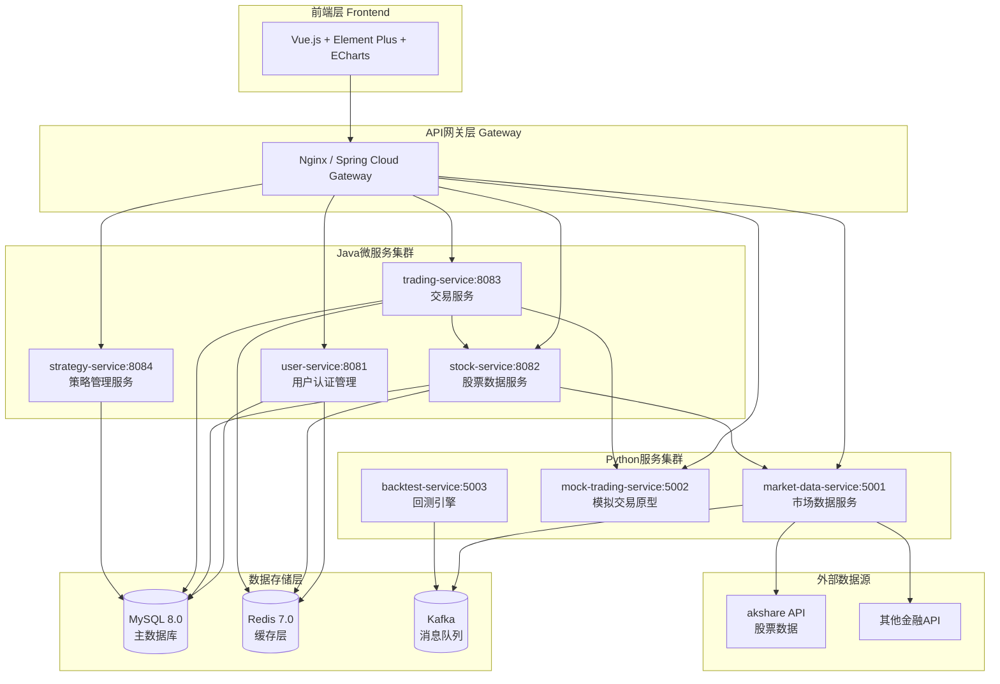
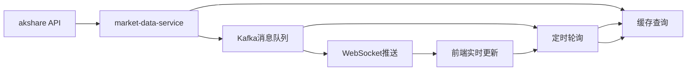
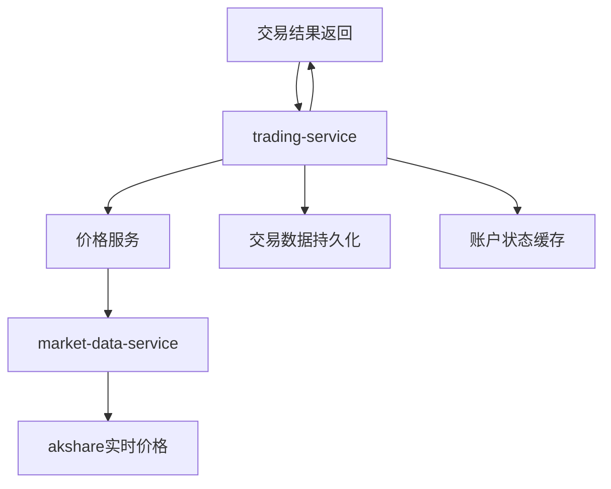
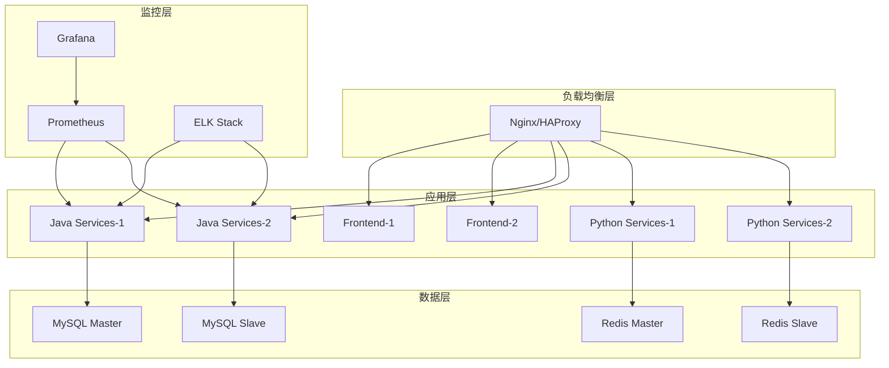

# WeQuant 量化交易平台 - 技术架构文档

## 📊 系统总体架构

### 🏗️ 微服务架构图



---

## 🔧 服务详细架构

### 1. 前端架构 (Frontend)

**技术栈**: Vue 3 + TypeScript + Vite + Element Plus + ECharts

```
web-frontend/
├── src/
│   ├── components/          # 公共组件
│   │   ├── StockHistoryChart.vue    # 智能响应式K线图
│   │   ├── TradingInterface.vue     # 交易界面
│   │   └── common/                  # 基础组件
│   ├── views/dashboard/     # 页面视图
│   │   ├── Home.vue                 # 仪表盘首页
│   │   ├── Trading.vue              # 交易页面
│   │   ├── Portfolio.vue            # 投资组合
│   │   └── Analysis.vue             # 数据分析
│   ├── store/               # 状态管理
│   │   ├── auth.js                  # 用户认证状态
│   │   ├── trading.js               # 交易状态
│   │   └── market.js                # 市场数据状态
│   ├── api/                 # API调用层
│   │   ├── stock.js                 # 股票数据API
│   │   ├── trading.js               # 交易API
│   │   └── user.js                  # 用户API
│   └── router/              # 路由配置
```

**核心特性**:

- 🎯 **智能响应式图表** - 基于视窗比例的动态 K 线图适配
- 📱 **多设备支持** - 手机、平板、桌面的原生体验
- ⚡ **实时数据更新** - WebSocket + 轮询的混合策略
- 🎨 **主题系统** - 深色/浅色模式切换

### 2. Java 微服务集群

#### 2.1 用户服务 (user-service:8081)

**技术栈**: Spring Boot 2.7.14 + Spring Security + JWT + MySQL

```java
com.quant.user/
├── controller/
│   ├── AuthController.java         # 登录注册
│   ├── UserController.java         # 用户管理
│   └── ProfileController.java      # 个人资料
├── service/
│   ├── AuthService.java            # 认证服务
│   ├── UserService.java            # 用户业务
│   └── JwtService.java             # JWT管理
├── entity/
│   ├── User.java                   # 用户实体
│   ├── UserProfile.java           # 用户资料
│   └── UserPreference.java        # 用户偏好
└── config/
    ├── SecurityConfig.java         # 安全配置
    └── JwtConfig.java              # JWT配置
```

**API 设计**:

```http
POST /api/v1/auth/register          # 用户注册
POST /api/v1/auth/login             # 用户登录
POST /api/v1/auth/logout            # 用户登出
GET  /api/v1/user/profile           # 获取个人资料
PUT  /api/v1/user/profile           # 更新个人资料
GET  /api/v1/user/preferences       # 获取用户偏好
```

#### 2.2 股票服务 (stock-service:8082)

**技术栈**: Spring Boot 2.7.14 + Redis + RestTemplate + Jackson

```java
com.quant.stock/
├── controller/
│   ├── StockController.java        # 股票数据控制器
│   └── MarketController.java       # 市场数据控制器
├── service/
│   ├── StockService.java           # 股票业务服务
│   ├── MarketDataService.java      # 市场数据服务
│   └── CacheService.java           # 缓存服务
├── dto/
│   ├── StockInfoDto.java           # 股票信息DTO
│   ├── HistoryDataDto.java         # 历史数据DTO
│   └── MarketDataDto.java          # 市场数据DTO
└── config/
    ├── RestTemplateConfig.java     # HTTP客户端配置
    └── RedisConfig.java            # Redis配置
```

**API 设计**:

```http
GET  /api/v1/stocks/{code}/latest   # 获取最新股价
GET  /api/v1/stocks/{code}/history  # 获取历史数据
GET  /api/v1/stocks/{code}/info     # 获取股票信息
GET  /api/v1/market/ranking         # 获取排行榜
GET  /api/v1/market/sectors         # 获取板块数据
```

#### 2.3 交易服务 (trading-service:8083)

**技术栈**: Spring Boot 2.7.14 + JPA + H2/MySQL + 事务管理

```java
com.quant.trading/
├── controller/
│   └── TradingController.java      # 交易控制器
├── service/
│   ├── TradingService.java         # 交易业务服务
│   ├── StockPriceService.java      # 股价服务
│   └── PortfolioService.java       # 投资组合服务
├── entity/
│   ├── TradingAccount.java         # 交易账户
│   ├── Position.java               # 持仓信息
│   └── Trade.java                  # 交易记录
├── repository/
│   ├── TradingAccountRepository.java
│   ├── PositionRepository.java
│   └── TradeRepository.java
└── dto/
    ├── TradeRequest.java           # 交易请求
    └── AccountInfoResponse.java    # 账户响应
```

**核心业务逻辑**:

```java
@Transactional
public Trade executeTrade(String userId, String stockCode, TradeType tradeType, Integer quantity, BigDecimal price) {
    // 1. 获取交易账户
    TradingAccount account = getAccount(userId);

    // 2. 计算交易金额和手续费
    BigDecimal amount = price.multiply(BigDecimal.valueOf(quantity));
    BigDecimal commission = amount.multiply(BigDecimal.valueOf(0.0003)); // 万三手续费

    // 3. 执行买入/卖出逻辑
    if (tradeType == TradeType.BUY) {
        executeBuyOrder(account, stockCode, quantity, price, amount, commission);
    } else {
        executeSellOrder(account, stockCode, quantity, price, amount, commission);
    }

    // 4. 记录交易历史
    return recordTrade(account, stockCode, tradeType, quantity, price, amount, commission);
}
```

### 3. Python 服务集群

#### 3.1 市场数据服务 (market-data-service:5001)

**技术栈**: FastAPI + akshare + asyncio + Redis

```python
market-data-service/
├── app.py                          # FastAPI应用入口
├── services/
│   ├── akshare_service.py          # akshare数据获取
│   ├── cache_service.py            # 缓存服务
│   └── data_processor.py           # 数据处理
├── models/
│   ├── stock_data.py               # 股票数据模型
│   └── market_data.py              # 市场数据模型
└── config/
    └── settings.py                 # 配置文件
```

**API 设计**:

```http
GET  /api/stocks/{code}/latest      # 获取最新股价
GET  /api/stocks/{code}/history     # 获取历史数据
GET  /api/market/ranking            # 获取涨跌排行
GET  /api/market/sectors            # 获取板块数据
```

#### 3.2 模拟交易服务 (mock-trading-service:5002)

**技术栈**: Flask + SQLite + akshare

```python
mock-trading-service/
├── app.py                          # Flask应用入口
├── models/
│   ├── account.py                  # 账户模型
│   ├── position.py                 # 持仓模型
│   └── trade.py                    # 交易模型
├── services/
│   ├── trading_service.py          # 交易业务
│   ├── portfolio_service.py        # 投资组合
│   └── price_service.py            # 价格服务
└── database/
    └── init.sql                    # 数据库初始化
```

---

## 🗄️ 数据库设计

### MySQL 主数据库

#### 用户相关表

```sql
-- 用户基础信息表
CREATE TABLE users (
    id BIGINT PRIMARY KEY AUTO_INCREMENT,
    username VARCHAR(50) UNIQUE NOT NULL,
    email VARCHAR(100) UNIQUE NOT NULL,
    password_hash VARCHAR(255) NOT NULL,
    full_name VARCHAR(100),
    phone VARCHAR(20),
    status ENUM('ACTIVE', 'INACTIVE', 'SUSPENDED') DEFAULT 'ACTIVE',
    risk_level ENUM('CONSERVATIVE', 'MODERATE', 'AGGRESSIVE') DEFAULT 'MODERATE',
    created_at TIMESTAMP DEFAULT CURRENT_TIMESTAMP,
    updated_at TIMESTAMP DEFAULT CURRENT_TIMESTAMP ON UPDATE CURRENT_TIMESTAMP
);

-- 用户偏好设置表
CREATE TABLE user_preferences (
    id BIGINT PRIMARY KEY AUTO_INCREMENT,
    user_id BIGINT NOT NULL,
    theme ENUM('LIGHT', 'DARK') DEFAULT 'LIGHT',
    language VARCHAR(10) DEFAULT 'zh-CN',
    timezone VARCHAR(50) DEFAULT 'Asia/Shanghai',
    notification_enabled BOOLEAN DEFAULT TRUE,
    FOREIGN KEY (user_id) REFERENCES users(id)
);
```

#### 交易相关表

```sql
-- 交易账户表
CREATE TABLE trading_accounts (
    id BIGINT PRIMARY KEY AUTO_INCREMENT,
    account_id VARCHAR(36) UNIQUE NOT NULL,
    user_id VARCHAR(36) NOT NULL,
    balance DECIMAL(15,2) DEFAULT 1000000.00,
    total_assets DECIMAL(15,2) DEFAULT 1000000.00,
    frozen_amount DECIMAL(15,2) DEFAULT 0.00,
    status ENUM('ACTIVE', 'FROZEN', 'CLOSED') DEFAULT 'ACTIVE',
    created_at TIMESTAMP DEFAULT CURRENT_TIMESTAMP,
    updated_at TIMESTAMP DEFAULT CURRENT_TIMESTAMP ON UPDATE CURRENT_TIMESTAMP
);

-- 持仓表
CREATE TABLE positions (
    id BIGINT PRIMARY KEY AUTO_INCREMENT,
    account_id VARCHAR(36) NOT NULL,
    stock_code VARCHAR(20) NOT NULL,
    stock_name VARCHAR(100) NOT NULL,
    quantity INT NOT NULL,
    avg_cost DECIMAL(10,2) NOT NULL,
    current_price DECIMAL(10,2),
    market_value DECIMAL(15,2),
    profit_loss DECIMAL(15,2),
    profit_loss_pct DECIMAL(5,2),
    created_at TIMESTAMP DEFAULT CURRENT_TIMESTAMP,
    updated_at TIMESTAMP DEFAULT CURRENT_TIMESTAMP ON UPDATE CURRENT_TIMESTAMP,
    UNIQUE KEY uk_account_stock (account_id, stock_code)
);

-- 交易记录表
CREATE TABLE trades (
    id BIGINT PRIMARY KEY AUTO_INCREMENT,
    trade_id VARCHAR(36) UNIQUE NOT NULL,
    account_id VARCHAR(36) NOT NULL,
    stock_code VARCHAR(20) NOT NULL,
    stock_name VARCHAR(100) NOT NULL,
    trade_type ENUM('BUY', 'SELL') NOT NULL,
    quantity INT NOT NULL,
    price DECIMAL(10,2) NOT NULL,
    amount DECIMAL(15,2) NOT NULL,
    commission DECIMAL(10,2) DEFAULT 0.00,
    status ENUM('PENDING', 'COMPLETED', 'CANCELLED', 'FAILED') DEFAULT 'PENDING',
    trade_time TIMESTAMP DEFAULT CURRENT_TIMESTAMP,
    updated_at TIMESTAMP DEFAULT CURRENT_TIMESTAMP ON UPDATE CURRENT_TIMESTAMP
);
```

### Redis 缓存设计

#### 缓存策略

```redis
# 股票实时数据缓存 (TTL: 30秒)
stock:latest:{code} = {
    "code": "000001.SZ",
    "price": 11.40,
    "change": 0.06,
    "change_pct": 0.53,
    "volume": 12847500,
    "timestamp": "2025-10-17 15:00:00"
}

# 股票历史数据缓存 (TTL: 1小时)
stock:history:{code}:{days} = [
    {"date": "2025-10-17", "open": 11.33, "high": 11.41, "low": 11.27, "close": 11.40, "volume": 12847500},
    ...
]

# 用户会话缓存 (TTL: 24小时)
session:{user_id} = {
    "user_id": "123",
    "username": "testuser",
    "role": "USER",
    "expires_at": "2025-10-18 15:00:00"
}

# 市场排行榜缓存 (TTL: 5分钟)
market:ranking:gainers = [
    {"code": "000001.SZ", "name": "平安银行", "change_pct": 5.23},
    ...
]
```

---

## 🔄 数据流设计

### 实时数据流



### 交易数据流



---

## 🚀 部署架构

### Docker Compose 架构

```yaml
version: "3.8"
services:
  # 前端服务
  web-frontend:
    build: ./web-frontend
    ports: [3000:3000]
    depends_on: [nginx]

  # Nginx反向代理
  nginx:
    image: nginx:alpine
    ports: [80:80, 443:443]
    volumes:
      - ./nginx/nginx.conf:/etc/nginx/nginx.conf

  # Java微服务
  user-service:
    build: ./user-service
    ports: [8081:8081]
    depends_on: [mysql, redis]
    environment:
      SPRING_PROFILES_ACTIVE: docker

  stock-service:
    build: ./stock-service
    ports: [8082:8082]
    depends_on: [mysql, redis, market-data-service]

  trading-service:
    build: ./trading-service
    ports: [8083:8083]
    depends_on: [mysql, redis, stock-service]

  # Python服务
  market-data-service:
    build: ./market-data-service
    ports: [5001:5001]
    depends_on: [redis, kafka]

  # 数据存储
  mysql:
    image: mysql:8.0
    ports: [3306:3306]
    environment:
      MYSQL_ROOT_PASSWORD: 123456
      MYSQL_DATABASE: quant_trading
    volumes:
      - mysql_data:/var/lib/mysql

  redis:
    image: redis:7-alpine
    ports: [6379:6379]
    command: redis-server --requirepass redis123456

  # 消息队列
  kafka:
    image: confluentinc/cp-kafka:latest
    ports: [9092:9092]
    depends_on: [zookeeper]
    environment:
      KAFKA_ZOOKEEPER_CONNECT: zookeeper:2181
      KAFKA_ADVERTISED_LISTENERS: PLAINTEXT://localhost:9092

  zookeeper:
    image: confluentinc/cp-zookeeper:latest
    ports: [2181:2181]
    environment:
      ZOOKEEPER_CLIENT_PORT: 2181

volumes:
  mysql_data:
```

### 生产环境架构



---

## 📊 性能与监控

### 性能指标

- **响应时间**: API 平均响应时间 < 200ms
- **吞吐量**: 支持 1000 QPS 并发请求
- **可用性**: 99.9%服务可用性
- **缓存命中率**: Redis 缓存命中率 > 95%

### 监控指标

```yaml
metrics:
  application:
    - api_request_duration_seconds
    - api_request_total
    - jvm_memory_used_bytes
    - database_connections_active

  business:
    - trading_orders_total
    - user_active_sessions
    - stock_data_refresh_rate
    - cache_hit_ratio

  infrastructure:
    - cpu_usage_percent
    - memory_usage_percent
    - disk_usage_percent
    - network_io_bytes
```

---

_最后更新: 2025-10-17_
_架构版本: V2.0 - 微服务 + 虚拟交易_
