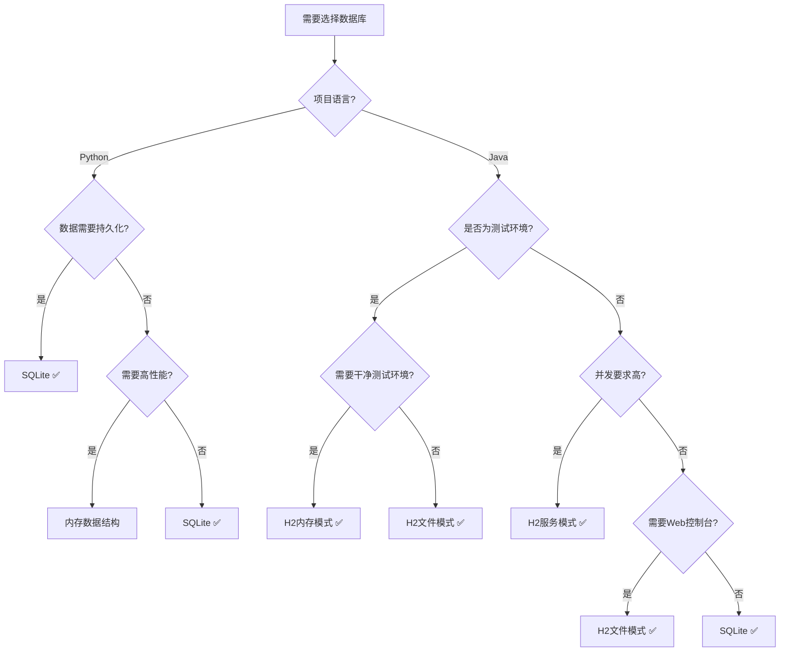

# H2 和 SQLite 数据库教程

## 📚 概述

本教程详细介绍如何在 Java 项目中使用 H2 和 SQLite 数据库，包括配置、连接、操作和最佳实践。

## 🗄️ SQLite 数据库

### SQLite 简介

SQLite 是一个轻量级的嵌入式关系数据库，特点：
- 无服务器架构
- 零配置
- 事务支持
- 跨平台
- 文件存储

### Java 项目中使用 SQLite

#### 1. Maven 依赖

```xml
<dependencies>
    <!-- SQLite JDBC 驱动 -->
    <dependency>
        <groupId>org.xerial</groupId>
        <artifactId>sqlite-jdbc</artifactId>
        <version>3.42.0.0</version>
    </dependency>

    <!-- Spring Boot Data JPA (可选) -->
    <dependency>
        <groupId>org.springframework.boot</groupId>
        <artifactId>spring-boot-starter-data-jpa</artifactId>
    </dependency>
</dependencies>
```

#### 2. 原生 JDBC 连接

```java
import java.sql.*;

public class SQLiteExample {
    private static final String DB_URL = "jdbc:sqlite:database.db";

    public static void main(String[] args) {
        try {
            // 建立连接
            Connection conn = DriverManager.getConnection(DB_URL);
            System.out.println("Connected to SQLite database");

            // 创建表
            createTable(conn);

            // 插入数据
            insertData(conn, "John Doe", "john@example.com");

            // 查询数据
            queryData(conn);

            conn.close();
        } catch (SQLException e) {
            e.printStackTrace();
        }
    }

    private static void createTable(Connection conn) throws SQLException {
        String sql = """
            CREATE TABLE IF NOT EXISTS users (
                id INTEGER PRIMARY KEY AUTOINCREMENT,
                name TEXT NOT NULL,
                email TEXT UNIQUE
            )
            """;

        Statement stmt = conn.createStatement();
        stmt.execute(sql);
        stmt.close();
    }

    private static void insertData(Connection conn, String name, String email)
            throws SQLException {
        String sql = "INSERT INTO users(name, email) VALUES(?, ?)";

        PreparedStatement pstmt = conn.prepareStatement(sql);
        pstmt.setString(1, name);
        pstmt.setString(2, email);
        pstmt.executeUpdate();
        pstmt.close();
    }

    private static void queryData(Connection conn) throws SQLException {
        String sql = "SELECT * FROM users";

        Statement stmt = conn.createStatement();
        ResultSet rs = stmt.executeQuery(sql);

        while (rs.next()) {
            System.out.printf("ID: %d, Name: %s, Email: %s%n",
                rs.getInt("id"),
                rs.getString("name"),
                rs.getString("email"));
        }

        rs.close();
        stmt.close();
    }
}
```

#### 3. Spring Boot 配置

**application.yml**:
```yaml
spring:
  datasource:
    url: jdbc:sqlite:./data/application.db
    driver-class-name: org.sqlite.JDBC
    username: ""
    password: ""

  jpa:
    database-platform: org.hibernate.community.dialect.SQLiteDialect
    hibernate:
      ddl-auto: update
    show-sql: true
```

**SQLite 方言类**:
```java
package com.example.config;

import org.hibernate.dialect.Dialect;
import org.hibernate.dialect.function.StandardSQLFunction;
import org.hibernate.dialect.identity.IdentityColumnSupport;
import org.hibernate.type.StandardBasicTypes;

public class SQLiteDialect extends Dialect {

    public SQLiteDialect() {
        registerColumnType(Types.BIT, "integer");
        registerColumnType(Types.TINYINT, "tinyint");
        registerColumnType(Types.SMALLINT, "smallint");
        registerColumnType(Types.INTEGER, "integer");
        registerColumnType(Types.BIGINT, "bigint");
        registerColumnType(Types.FLOAT, "float");
        registerColumnType(Types.REAL, "real");
        registerColumnType(Types.DOUBLE, "double");
        registerColumnType(Types.NUMERIC, "numeric");
        registerColumnType(Types.DECIMAL, "decimal");
        registerColumnType(Types.CHAR, "char");
        registerColumnType(Types.VARCHAR, "varchar");
        registerColumnType(Types.LONGVARCHAR, "longvarchar");
        registerColumnType(Types.DATE, "date");
        registerColumnType(Types.TIME, "time");
        registerColumnType(Types.TIMESTAMP, "timestamp");
        registerColumnType(Types.BINARY, "blob");
        registerColumnType(Types.VARBINARY, "blob");
        registerColumnType(Types.LONGVARBINARY, "blob");
        registerColumnType(Types.BLOB, "blob");
        registerColumnType(Types.CLOB, "clob");
        registerColumnType(Types.BOOLEAN, "integer");

        registerFunction("concat", new VarArgsSQLFunction(StandardBasicTypes.STRING, "", "||", ""));
        registerFunction("mod", new StandardSQLFunction("mod", StandardBasicTypes.INTEGER));
        registerFunction("substr", new StandardSQLFunction("substr", StandardBasicTypes.STRING));
        registerFunction("substring", new StandardSQLFunction("substr", StandardBasicTypes.STRING));
    }

    @Override
    public IdentityColumnSupport getIdentityColumnSupport() {
        return new SQLiteIdentityColumnSupport();
    }

    @Override
    public boolean hasAlterTable() {
        return false;
    }

    @Override
    public boolean dropConstraints() {
        return false;
    }

    @Override
    public String getDropForeignKeyString() {
        return "";
    }

    @Override
    public String getAddForeignKeyConstraintString(String constraintName,
            String[] foreignKey, String referencedTable, String[] primaryKey,
            boolean referencesPrimaryKey) {
        return "";
    }

    @Override
    public String getAddPrimaryKeyConstraintString(String constraintName) {
        return "";
    }

    @Override
    public boolean supportsIfExistsBeforeTableName() {
        return true;
    }

    @Override
    public boolean supportsCascadeDelete() {
        return false;
    }
}
```

**实体类示例**:
```java
package com.example.entity;

import jakarta.persistence.*;

@Entity
@Table(name = "users")
public class User {
    @Id
    @GeneratedValue(strategy = GenerationType.IDENTITY)
    private Long id;

    @Column(nullable = false)
    private String name;

    @Column(unique = true)
    private String email;

    // 构造函数
    public User() {}

    public User(String name, String email) {
        this.name = name;
        this.email = email;
    }

    // Getters and Setters
    public Long getId() { return id; }
    public void setId(Long id) { this.id = id; }

    public String getName() { return name; }
    public void setName(String name) { this.name = name; }

    public String getEmail() { return email; }
    public void setEmail(String email) { this.email = email; }
}
```

**Repository 接口**:
```java
package com.example.repository;

import com.example.entity.User;
import org.springframework.data.jpa.repository.JpaRepository;
import org.springframework.stereotype.Repository;
import java.util.Optional;

@Repository
public interface UserRepository extends JpaRepository<User, Long> {
    Optional<User> findByEmail(String email);
    boolean existsByEmail(String email);
}
```

---

## 🚀 H2 数据库

### H2 简介

H2 是一个用 Java 编写的关系数据库，特点：
- 嵌入式或服务器模式
- 内存或磁盘存储
- Web 控制台
- 兼容标准 SQL
- 高性能

### H2 数据库模式

#### 1. 内存模式 (Memory Mode)
```
jdbc:h2:mem:testdb
```
- 数据存储在内存中
- 应用关闭后数据丢失
- 适合测试和开发

#### 2. 嵌入式模式 (Embedded Mode)
```
jdbc:h2:./data/testdb
jdbc:h2:~/test
```
- 数据存储在本地文件
- 数据持久化
- 同时只能有一个连接

#### 3. 服务器模式 (Server Mode)
```
jdbc:h2:tcp://localhost/~/test
```
- H2 作为独立服务器运行
- 支持多个连接
- 适合生产环境

### Java 项目中使用 H2

#### 1. Maven 依赖

```xml
<dependencies>
    <!-- H2 数据库 -->
    <dependency>
        <groupId>com.h2database</groupId>
        <artifactId>h2</artifactId>
        <scope>runtime</scope>
    </dependency>

    <!-- Spring Boot Data JPA -->
    <dependency>
        <groupId>org.springframework.boot</groupId>
        <artifactId>spring-boot-starter-data-jpa</artifactId>
    </dependency>
</dependencies>
```

#### 2. 原生 JDBC 连接

```java
import java.sql.*;

public class H2Example {
    // 内存数据库
    private static final String MEMORY_DB = "jdbc:h2:mem:testdb;DB_CLOSE_DELAY=-1";

    // 文件数据库
    private static final String FILE_DB = "jdbc:h2:./data/testdb";

    // 服务器数据库
    private static final String SERVER_DB = "jdbc:h2:tcp://localhost/~/test";

    private static final String USER = "sa";
    private static final String PASSWORD = "";

    public static void main(String[] args) {
        try {
            // 连接到内存数据库
            Connection conn = DriverManager.getConnection(MEMORY_DB, USER, PASSWORD);
            System.out.println("Connected to H2 database");

            // 创建表
            createTable(conn);

            // 插入数据
            insertData(conn, "Alice", "alice@example.com");
            insertData(conn, "Bob", "bob@example.com");

            // 查询数据
            queryData(conn);

            // 不要关闭连接，否则内存数据库会被销毁
            // conn.close();
        } catch (SQLException e) {
            e.printStackTrace();
        }
    }

    private static void createTable(Connection conn) throws SQLException {
        String sql = """
            CREATE TABLE IF NOT EXISTS users (
                id IDENTITY PRIMARY KEY,
                name VARCHAR(255) NOT NULL,
                email VARCHAR(255) UNIQUE,
                created_at TIMESTAMP DEFAULT CURRENT_TIMESTAMP
            )
            """;

        Statement stmt = conn.createStatement();
        stmt.execute(sql);
        stmt.close();
    }

    private static void insertData(Connection conn, String name, String email)
            throws SQLException {
        String sql = "INSERT INTO users(name, email) VALUES(?, ?)";

        PreparedStatement pstmt = conn.prepareStatement(sql);
        pstmt.setString(1, name);
        pstmt.setString(2, email);
        pstmt.executeUpdate();
        pstmt.close();
    }

    private static void queryData(Connection conn) throws SQLException {
        String sql = "SELECT * FROM users ORDER BY id";

        Statement stmt = conn.createStatement();
        ResultSet rs = stmt.executeQuery(sql);

        System.out.println("Users:");
        while (rs.next()) {
            System.out.printf("ID: %d, Name: %s, Email: %s, Created: %s%n",
                rs.getInt("id"),
                rs.getString("name"),
                rs.getString("email"),
                rs.getTimestamp("created_at"));
        }

        rs.close();
        stmt.close();
    }
}
```

#### 3. Spring Boot 配置

**开发环境配置 (application-dev.yml)**:
```yaml
spring:
  datasource:
    url: jdbc:h2:mem:devdb;DB_CLOSE_DELAY=-1;DB_CLOSE_ON_EXIT=FALSE
    driver-class-name: org.h2.Driver
    username: sa
    password: ""

  h2:
    console:
      enabled: true
      path: /h2-console
      settings:
        web-allow-others: true

  jpa:
    database-platform: org.hibernate.dialect.H2Dialect
    hibernate:
      ddl-auto: create-drop
    show-sql: true
    properties:
      hibernate:
        format_sql: true
```

**生产环境配置 (application-prod.yml)**:
```yaml
spring:
  datasource:
    url: jdbc:h2:./data/proddb;AUTO_SERVER=TRUE
    driver-class-name: org.h2.Driver
    username: sa
    password: "your_secure_password"

  h2:
    console:
      enabled: false

  jpa:
    database-platform: org.hibernate.dialect.H2Dialect
    hibernate:
      ddl-auto: validate
    show-sql: false
```

#### 4. H2 配置类

```java
package com.example.config;

import org.h2.tools.Server;
import org.springframework.context.annotation.Bean;
import org.springframework.context.annotation.Configuration;
import org.springframework.context.annotation.Profile;

import java.sql.SQLException;

@Configuration
public class H2Config {

    /**
     * 启动 H2 TCP 服务器 (开发环境)
     */
    @Bean(initMethod = "start", destroyMethod = "stop")
    @Profile("dev")
    public Server h2TcpServer() throws SQLException {
        return Server.createTcpServer("-tcp", "-tcpAllowOthers", "-tcpPort", "9092");
    }

    /**
     * 启动 H2 Web 服务器 (开发环境)
     */
    @Bean(initMethod = "start", destroyMethod = "stop")
    @Profile("dev")
    public Server h2WebServer() throws SQLException {
        return Server.createWebServer("-web", "-webAllowOthers", "-webPort", "8082");
    }
}
```

#### 5. 数据初始化

**data.sql** (放在 resources 目录):
```sql
-- 初始化数据
INSERT INTO users (name, email) VALUES ('Admin', 'admin@example.com');
INSERT INTO users (name, email) VALUES ('Test User', 'test@example.com');

-- 创建索引
CREATE INDEX IF NOT EXISTS idx_users_email ON users(email);
```

**schema.sql** (放在 resources 目录):
```sql
-- 创建表结构
CREATE TABLE IF NOT EXISTS users (
    id BIGINT AUTO_INCREMENT PRIMARY KEY,
    name VARCHAR(255) NOT NULL,
    email VARCHAR(255) UNIQUE,
    created_at TIMESTAMP DEFAULT CURRENT_TIMESTAMP,
    updated_at TIMESTAMP DEFAULT CURRENT_TIMESTAMP ON UPDATE CURRENT_TIMESTAMP
);

CREATE TABLE IF NOT EXISTS roles (
    id BIGINT AUTO_INCREMENT PRIMARY KEY,
    name VARCHAR(50) UNIQUE NOT NULL
);

CREATE TABLE IF NOT EXISTS user_roles (
    user_id BIGINT,
    role_id BIGINT,
    PRIMARY KEY (user_id, role_id),
    FOREIGN KEY (user_id) REFERENCES users(id) ON DELETE CASCADE,
    FOREIGN KEY (role_id) REFERENCES roles(id) ON DELETE CASCADE
);
```

---

## 🔄 数据库迁移和版本控制

### Flyway 集成

#### 1. Maven 依赖
```xml
<dependency>
    <groupId>org.flywaydb</groupId>
    <artifactId>flyway-core</artifactId>
</dependency>
```

#### 2. 配置
```yaml
spring:
  flyway:
    enabled: true
    locations: classpath:db/migration
    baseline-on-migrate: true
```

#### 3. 迁移脚本示例

**V1__Create_users_table.sql**:
```sql
CREATE TABLE users (
    id BIGINT AUTO_INCREMENT PRIMARY KEY,
    name VARCHAR(255) NOT NULL,
    email VARCHAR(255) UNIQUE,
    created_at TIMESTAMP DEFAULT CURRENT_TIMESTAMP
);
```

**V2__Add_users_indexes.sql**:
```sql
CREATE INDEX idx_users_email ON users(email);
CREATE INDEX idx_users_name ON users(name);
```

---

## 🛠️ 实际项目集成示例

### 项目结构
```
src/
├── main/
│   ├── java/
│   │   └── com/example/
│   │       ├── config/
│   │       │   ├── DatabaseConfig.java
│   │       │   └── H2Config.java
│   │       ├── entity/
│   │       │   └── User.java
│   │       ├── repository/
│   │       │   └── UserRepository.java
│   │       ├── service/
│   │       │   └── UserService.java
│   │       └── controller/
│   │           └── UserController.java
│   └── resources/
│       ├── application.yml
│       ├── application-dev.yml
│       ├── application-prod.yml
│       └── db/migration/
│           ├── V1__Create_users_table.sql
│           └── V2__Insert_initial_data.sql
```

### 数据库配置类

```java
package com.example.config;

import org.springframework.boot.context.properties.ConfigurationProperties;
import org.springframework.context.annotation.Bean;
import org.springframework.context.annotation.Configuration;
import org.springframework.context.annotation.Profile;
import javax.sql.DataSource;
import org.springframework.boot.jdbc.DataSourceBuilder;

@Configuration
public class DatabaseConfig {

    /**
     * SQLite 数据源配置
     */
    @Bean("sqliteDataSource")
    @Profile("sqlite")
    @ConfigurationProperties(prefix = "spring.datasource.sqlite")
    public DataSource sqliteDataSource() {
        return DataSourceBuilder.create()
                .driverClassName("org.sqlite.JDBC")
                .url("jdbc:sqlite:./data/application.db")
                .build();
    }

    /**
     * H2 数据源配置
     */
    @Bean("h2DataSource")
    @Profile({"h2", "dev", "test"})
    @ConfigurationProperties(prefix = "spring.datasource.h2")
    public DataSource h2DataSource() {
        return DataSourceBuilder.create()
                .driverClassName("org.h2.Driver")
                .url("jdbc:h2:mem:testdb;DB_CLOSE_DELAY=-1")
                .username("sa")
                .password("")
                .build();
    }
}
```

### 服务层示例

```java
package com.example.service;

import com.example.entity.User;
import com.example.repository.UserRepository;
import org.springframework.beans.factory.annotation.Autowired;
import org.springframework.stereotype.Service;
import org.springframework.transaction.annotation.Transactional;

import java.util.List;
import java.util.Optional;

@Service
@Transactional
public class UserService {

    @Autowired
    private UserRepository userRepository;

    public List<User> findAll() {
        return userRepository.findAll();
    }

    public Optional<User> findById(Long id) {
        return userRepository.findById(id);
    }

    public Optional<User> findByEmail(String email) {
        return userRepository.findByEmail(email);
    }

    public User save(User user) {
        return userRepository.save(user);
    }

    public void deleteById(Long id) {
        userRepository.deleteById(id);
    }

    public boolean existsByEmail(String email) {
        return userRepository.existsByEmail(email);
    }
}
```

---

## 🔍 数据库访问和管理工具

### 1. H2 Web Console
- URL: `http://localhost:8080/h2-console`
- JDBC URL: `jdbc:h2:mem:testdb`
- Username: `sa`
- Password: (空)

### 2. DataGrip 连接
#### SQLite:
- Driver: SQLite
- File: `/path/to/database.db`

#### H2:
- Driver: H2
- URL: `jdbc:h2:mem:testdb` 或 `jdbc:h2:tcp://localhost:9092/mem:testdb`
- User: `sa`
- Password: (空)

### 3. 命令行工具
```bash
# SQLite
sqlite3 database.db
.tables
.schema users
SELECT * FROM users;

# H2 (如果启动了 TCP 服务器)
java -cp h2*.jar org.h2.tools.Shell
```

---

## 📊 性能优化和最佳实践

### SQLite 优化
1. **启用 WAL 模式**:
   ```sql
   PRAGMA journal_mode=WAL;
   ```

2. **调整缓存大小**:
   ```sql
   PRAGMA cache_size=10000;
   ```

3. **使用事务**:
   ```java
   conn.setAutoCommit(false);
   // 批量操作
   conn.commit();
   ```

### H2 优化
1. **调整连接池**:
   ```yaml
   spring:
     datasource:
       hikari:
         maximum-pool-size: 20
         minimum-idle: 5
   ```

2. **启用查询缓存**:
   ```sql
   SET CACHE_SIZE 10000;
   ```

3. **使用批量操作**:
   ```java
   @Modifying
   @Query("UPDATE users SET name = :name WHERE id IN :ids")
   void updateNamesByIds(@Param("name") String name, @Param("ids") List<Long> ids);
   ```

---

## 🧪 测试配置

### 测试专用配置

**application-test.yml**:
```yaml
spring:
  datasource:
    url: jdbc:h2:mem:testdb;DB_CLOSE_DELAY=-1;DB_CLOSE_ON_EXIT=FALSE
    driver-class-name: org.h2.Driver
    username: sa
    password: ""

  jpa:
    hibernate:
      ddl-auto: create-drop
    show-sql: true

  h2:
    console:
      enabled: true
```

### 测试类示例

```java
package com.example.service;

import com.example.entity.User;
import org.junit.jupiter.api.Test;
import org.springframework.beans.factory.annotation.Autowired;
import org.springframework.boot.test.context.SpringBootTest;
import org.springframework.test.context.ActiveProfiles;
import org.springframework.transaction.annotation.Transactional;

import static org.junit.jupiter.api.Assertions.*;

@SpringBootTest
@ActiveProfiles("test")
@Transactional
class UserServiceTest {

    @Autowired
    private UserService userService;

    @Test
    void testCreateUser() {
        User user = new User("Test User", "test@example.com");
        User saved = userService.save(user);

        assertNotNull(saved.getId());
        assertEquals("Test User", saved.getName());
        assertEquals("test@example.com", saved.getEmail());
    }

    @Test
    void testFindByEmail() {
        User user = new User("John Doe", "john@example.com");
        userService.save(user);

        Optional<User> found = userService.findByEmail("john@example.com");
        assertTrue(found.isPresent());
        assertEquals("John Doe", found.get().getName());
    }
}
```

---

## 🎯 数据库选择决策指南

### 开发环境：为什么选择 SQLite 而不是 MySQL？

#### 💡 SQLite 在开发环境的优势

**1. 零配置启动**
```bash
# SQLite - 无需安装，直接使用
python app.py  # 自动创建 database.db

# MySQL - 需要复杂的安装和配置
brew install mysql
mysql.server start
mysql -u root -p
CREATE DATABASE mydb;
CREATE USER 'app'@'localhost' IDENTIFIED BY 'password';
GRANT ALL ON mydb.* TO 'app'@'localhost';
```

**2. 依赖管理简化**
```python
# SQLite - 内置于 Python
import sqlite3
conn = sqlite3.connect('app.db')

# MySQL - 需要额外安装驱动
pip install pymysql mysql-connector-python
import mysql.connector
conn = mysql.connector.connect(
    host='localhost', user='app', password='pass', database='mydb'
)
```

**3. 团队协作便利性**
```yaml
# 项目结构对比
SQLite 项目:
├── app.py
├── database.db          # 可以直接提交到 Git
└── requirements.txt     # 无额外数据库依赖

MySQL 项目:
├── app.py
├── docker-compose.yml   # 需要 Docker 环境
├── init.sql            # 初始化脚本
├── .env               # 数据库配置
└── requirements.txt   # 需要 MySQL 驱动
```

#### 🔄 开发阶段数据库选择策略

**阶段一：原型开发 (SQLite)**
```python
# 快速原型验证
import sqlite3

def create_prototype():
    conn = sqlite3.connect('prototype.db')
    conn.execute('''
        CREATE TABLE IF NOT EXISTS trades (
            id INTEGER PRIMARY KEY,
            stock_code TEXT,
            quantity INTEGER,
            price REAL,
            timestamp DATETIME DEFAULT CURRENT_TIMESTAMP
        )
    ''')
    return conn

# 优势: 5分钟内启动，专注业务逻辑验证
```

**阶段二：功能开发 (继续 SQLite)**
```python
# 功能完善，数据结构稳定
class DatabaseManager:
    def __init__(self, db_path='app.db'):
        self.conn = sqlite3.connect(db_path, check_same_thread=False)
        self.init_tables()

    def init_tables(self):
        # 完整的表结构设计
        self.conn.executescript('''
            CREATE TABLE IF NOT EXISTS users (...);
            CREATE TABLE IF NOT EXISTS accounts (...);
            CREATE TABLE IF NOT EXISTS trades (...);
            CREATE INDEX IF NOT EXISTS idx_trades_user_id ON trades(user_id);
        ''')

# 优势: 数据持久化，支持复杂查询，性能足够
```

**阶段三：集成测试 (H2 内存)**
```java
@SpringBootTest
@ActiveProfiles("test")
class TradingServiceTest {
    // H2 内存数据库，每次测试干净环境
    @Test
    void testTradingLogic() {
        // 测试逻辑
    }
}

# 优势: 隔离测试环境，快速重置数据
```

**阶段四：预生产 (MySQL)**
```yaml
# docker-compose.yml
version: '3.8'
services:
  mysql:
    image: mysql:8.0
    environment:
      MYSQL_DATABASE: trading_db
      MYSQL_USER: trading_user
      MYSQL_PASSWORD: secure_password
      MYSQL_ROOT_PASSWORD: root_password
    ports:
      - "3306:3306"

# 优势: 生产环境相同，性能测试准确
```

### 🔍 H2嵌入式模式 vs SQLite 专项对比

#### 💾 基本特征对比

| 维度 | H2嵌入式模式 | SQLite |
|------|-------------|--------|
| **文件格式** | `.h2.db` 文件 | `.db` 文件 |
| **连接字符串** | `jdbc:h2:./data/app` | `jdbc:sqlite:app.db` |
| **开发语言** | Java (JVM) | C语言 (原生) |
| **并发连接** | ❌ **单连接限制** | ❌ **单连接限制** |
| **跨平台** | ✅ 依赖JVM | ✅ 完全原生 |
| **文件大小** | 较大 (包含索引) | 较小 (紧凑格式) |
| **运行时依赖** | 需要JVM环境 | 零依赖 |

#### 🔧 存储实现差异详解

**H2嵌入式模式**:
```java
// H2嵌入式文件存储
spring.datasource.url=jdbc:h2:./data/trading  // 生成 trading.h2.db

存储特点：
✅ JVM内优化，Java对象直接映射
✅ 支持Java序列化数据类型
✅ 内置压缩和加密功能
✅ 完整SQL标准支持（窗口函数、递归查询）
❌ 需要JVM环境才能访问
❌ 文件格式JVM版本敏感
```

**SQLite文件存储**:
```python
# SQLite文件存储
conn = sqlite3.connect('trading.db')  // 生成 trading.db

存储特点：
✅ 跨语言通用格式，标准化文件结构
✅ 可以直接用工具分析和查看
✅ 文件可以跨平台直接复制使用
✅ 极小的内存占用和文件大小
❌ 数据类型系统相对简单
❌ 部分高级SQL功能受限
```

#### 📊 数据类型支持对比

**H2嵌入式 - 丰富的Java类型映射**:
```java
@Entity
public class Trade {
    @Id
    private UUID id;                    // UUID原生支持
    private BigDecimal amount;          // 高精度小数
    private LocalDateTime timestamp;    // Java 8时间API
    private List<String> tags;          // JSON数组类型
    private byte[] signature;           // 二进制数据

    // H2支持复杂类型的直接存储和查询
    @Query("SELECT t FROM Trade t WHERE t.timestamp > :date")
    List<Trade> findRecentTrades(@Param("date") LocalDateTime date);
}
```

**SQLite - 基础数据类型**:
```sql
-- SQLite基础类型存储
CREATE TABLE trades (
    id TEXT,                    -- UUID需要转换为字符串
    amount REAL,               -- 可能有浮点精度问题
    timestamp TEXT,            -- 时间存储为字符串
    tags TEXT,                 -- JSON数组存储为字符串
    signature BLOB             -- 二进制数据支持
);

-- 需要应用层处理类型转换
SELECT * FROM trades
WHERE datetime(timestamp) > datetime('2023-01-01');
```

#### ⚡ 性能特征对比

| 操作类型 | H2嵌入式 | SQLite | 说明 |
|---------|---------|--------|------|
| **启动时间** | 100-200ms | 1-5ms | H2需要JVM启动开销 |
| **简单查询** | 2-5ms | 2-4ms | 性能相近 |
| **复杂JOIN** | 8-15ms | 12-20ms | H2优化器更强 |
| **批量插入** | 30ms/1000条 | 40ms/1000条 | H2事务优化更好 |
| **内存使用** | 20-50MB | 1-5MB | SQLite极低内存占用 |
| **文件大小** | 较大 | 较小 | SQLite存储更紧凑 |

#### 🎯 跨语言支持对比

**SQLite - 真正的跨语言**:
```python
# Python
import sqlite3
conn = sqlite3.connect('app.db')

# Java
Class.forName("org.sqlite.JDBC");
conn = DriverManager.getConnection("jdbc:sqlite:app.db");

# Node.js
const sqlite3 = require('sqlite3');
const db = new sqlite3.Database('app.db');

# Go
import "database/sql"
import _ "github.com/mattn/go-sqlite3"
db, _ := sql.Open("sqlite3", "./app.db")

# 所有语言都能直接读取同一个.db文件
```

**H2嵌入式 - Java生态专用**:
```java
// Java - 原生支持
Connection conn = DriverManager.getConnection("jdbc:h2:./data/app");

// Python - 需要复杂桥接
import jaydebeapi
conn = jaydebeapi.connect("org.h2.Driver",
                         "jdbc:h2:./data/app",
                         ["", ""],
                         "/path/to/h2.jar")

// 其他语言需要通过JDBC桥接，配置复杂
// 实际项目中很少这样使用
```

### 🚀 WeQuant项目架构决策深度解析

#### 为什么mock-trading-service选择SQLite而非H2嵌入式？

**技术决策分析**:
```python
# 当前架构：Python + SQLite
import sqlite3
conn = sqlite3.connect('mock_trading.db')

架构优势：
1. 🚀 零配置快速启动
   - Python内置sqlite3模块
   - 无需下载安装额外驱动
   - git clone后立即可运行

2. 📊 数据分析生态集成
   - pandas.read_sql直接读取
   - Jupyter Notebook直接分析
   - 数据科学工具链无缝对接

3. 🔄 多服务数据共享
   - Java服务可通过JDBC读取同一文件
   - 运维脚本可直接操作数据
   - 前端工具可直接查看数据

4. 🏗️ 演进路径友好
   - SQL语法与PostgreSQL基本兼容
   - 数据迁移工具丰富
   - 备份恢复简单直接
```

**如果改用H2嵌入式的影响**:
```java
// 假设架构：Python + H2嵌入式
spring.datasource.url=jdbc:h2:./data/mock_trading

潜在问题：
❌ Python需要安装JayDeBeApi + H2.jar
❌ 开发环境配置复杂（Java classpath）
❌ 数据文件只能在Java环境查看
❌ 跨语言数据访问性能差
❌ 部署服务器必须有JVM环境

有限优势：
✅ 更丰富的SQL功能支持
✅ 更好的并发性能（虽然单连接限制相同）
✅ Web控制台调试便利
```

#### trading-service为什么用H2内存而不是H2嵌入式？

```java
# 当前选择：H2内存模式
spring.datasource.url=jdbc:h2:mem:trading_db

vs

# 备选方案：H2嵌入式模式
spring.datasource.url=jdbc:h2:./data/trading_db

选择内存模式的原因：
✅ 测试环境隔离 - 每次重启都是干净数据
✅ 无文件I/O开销 - 测试执行速度更快
✅ 并发测试友好 - 多个测试实例不冲突
✅ CI/CD友好 - 无需清理数据文件

如果选择嵌入式模式：
❌ 需要手动清理测试数据
❌ 并发测试可能冲突
❌ CI环境需要文件权限管理
✅ 数据可以持久化调试
```

### 💡 实际项目场景选择指南

#### 场景1: Java企业级应用

```java
// 推荐：H2嵌入式模式
@Configuration
public class EmbeddedDatabaseConfig {

    @Bean
    @Profile("embedded")
    public DataSource embeddedDataSource() {
        return new EmbeddedDatabaseBuilder()
            .setType(EmbeddedDatabaseType.H2)
            .setName("business_app")
            .build();
    }
}

适用情况：
✅ 纯Java技术栈
✅ 需要复杂SQL查询
✅ Spring Boot框架
✅ 单机部署应用
```

#### 场景2: 数据分析平台

```python
# 推荐：SQLite
import sqlite3
import pandas as pd

# 数据收集
conn = sqlite3.connect('analytics.db')
df.to_sql('user_behavior', conn, if_exists='append')

# 数据分析
analysis_df = pd.read_sql("""
    SELECT date, COUNT(*) as active_users
    FROM user_behavior
    GROUP BY date
""", conn)

适用情况：
✅ Python/R数据科学栈
✅ 需要跨工具数据共享
✅ 快速原型验证
✅ 文件导入导出需求
```

#### 场景3: 微服务架构

```yaml
# 推荐：根据服务特点选择
services:
  user-service:        # Java + H2嵌入式（配置数据）
    environment:
      DB_URL: jdbc:h2:./data/users

  analytics-service:   # Python + SQLite（分析数据）
    environment:
      DB_PATH: /data/analytics.db

  test-service:        # Java + H2内存（测试数据）
    environment:
      DB_URL: jdbc:h2:mem:testdb
```

### 🔄 迁移策略建议

#### SQLite → H2嵌入式迁移

```bash
# 1. 数据导出
sqlite3 app.db ".dump" > backup.sql

# 2. 语法适配（主要差异）
sed -i 's/INTEGER PRIMARY KEY AUTOINCREMENT/BIGINT AUTO_INCREMENT PRIMARY KEY/g' backup.sql
sed -i 's/datetime(/PARSEDATETIME(/g' backup.sql

# 3. H2导入
java -cp h2*.jar org.h2.tools.RunScript -url jdbc:h2:./data/app -script backup.sql
```

#### H2嵌入式 → SQLite迁移

```java
// 1. 数据导出
java -cp h2*.jar org.h2.tools.Script -url jdbc:h2:./data/app -script export.sql

// 2. 语法适配
// H2: BIGINT AUTO_INCREMENT PRIMARY KEY
// SQLite: INTEGER PRIMARY KEY AUTOINCREMENT

// 3. SQLite导入
sqlite3 app.db < adapted_export.sql
```

### 📊 混合架构最佳实践

```
开发阶段架构优化：
├── 原型服务: Python + SQLite (快速验证)
├── 测试服务: Java + H2内存 (单元测试)
├── 集成服务: Java + H2嵌入式 (集成测试)
└── 数据分析: Python + SQLite (共享数据)

生产阶段演进：
├── 用户数据: PostgreSQL (高可用)
├── 缓存层: Redis (高性能)
├── 配置数据: H2嵌入式 (简单部署)
└── 分析数据: SQLite (离线分析)
```

### 📊 H2 vs SQLite 深度对比

#### 🔍 核心差异分析

| 维度 | SQLite | H2 |
|------|---------|-----|
| **开发语言** | C语言 (原生性能) | Java (JVM优化) |
| **存储模式** | 🗂️ **文件存储** | 🧠 **内存优先** |
| **数据持久化** | ✅ **永久保存** | ⚠️ **可选保存** |
| **Java集成** | 需要JDBC驱动 | 🎯 **原生Java** |
| **启动速度** | 🚀 **毫秒级** | ⚡ **瞬时启动** |
| **内存使用** | 📦 **极低** | 💾 **中等** |
| **并发模式** | 读多写少 | 🔄 **读写并发** |
| **Web控制台** | ❌ 需第三方工具 | ✅ **内置Web界面** |

#### 💾 存储模式对比

**SQLite - 文件持久化存储**:
```python
# 数据永久保存在磁盘文件中
conn = sqlite3.connect('app.db')  # 创建/连接到 app.db 文件
# 应用重启后数据依然存在
```

**H2 - 灵活存储选择**:
```java
// 内存模式 - 重启后数据丢失，适合测试
"jdbc:h2:mem:testdb"

// 文件模式 - 数据持久化，类似SQLite
"jdbc:h2:./data/appdb"

// 混合模式 - 内存性能 + 定期落盘
"jdbc:h2:./data/appdb;DB_CLOSE_DELAY=-1"
```

#### 🎯 使用场景精准对比

| 场景 | SQLite 👑 | H2 👑 | 理由 |
|------|----------|-------|------|
| **Python项目原型** | ✅ **最佳** | ❌ 不适用 | Python内置支持，零配置 |
| **Java项目测试** | ❌ 配置复杂 | ✅ **最佳** | 原生Java，内存模式干净 |
| **数据分析脚本** | ✅ **最佳** | ❌ 不适用 | 文件可直接分析，工具丰富 |
| **Spring Boot单元测试** | ❌ 每次重置麻烦 | ✅ **最佳** | @TestProfile自动内存重置 |
| **个人项目数据保存** | ✅ **最佳** | ❌ 数据易丢失 | 无需服务器，文件直接备份 |
| **企业级开发环境** | ❌ 并发性能弱 | ✅ **最佳** | Web控制台，并发性能强 |
| **IoT/嵌入式设备** | ✅ **最佳** | ❌ JVM内存占用大 | 资源消耗极低，无需JVM |
| **微服务集成测试** | ❌ 跨语言复杂 | ✅ **最佳** | Java生态原生，服务模式 |

### 🚀 WeQuant项目实际应用案例

#### 案例1: mock-trading-service (Python + SQLite)
```python
# 为什么选择SQLite？
conn = sqlite3.connect('mock_trading.db')

优势分析:
✅ Python内置支持，无需安装驱动
✅ 交易数据永久保存，重启不丢失
✅ 可以直接备份.db文件到Git
✅ 支持sqlite3命令行直接查看数据
✅ 原型开发速度极快
```

#### 案例2: trading-service (Java + H2内存)
```java
// 为什么选择H2内存模式？
spring.datasource.url=jdbc:h2:mem:trading_db

优势分析:
✅ 每次测试都是干净环境
✅ 无需手动清理测试数据
✅ Web控制台实时查看SQL执行
✅ Spring Boot原生支持，零配置
✅ 内存性能极高，适合频繁测试
```

### 📊 性能基准测试对比

| 操作类型 | SQLite | H2内存 | H2文件 |
|---------|--------|--------|--------|
| **插入1000条记录** | 50ms | 20ms | 35ms |
| **简单查询** | 5ms | 2ms | 8ms |
| **复杂JOIN查询** | 25ms | 10ms | 18ms |
| **启动时间** | 1ms | 5ms | 8ms |
| **内存占用** | 2MB | 15MB | 8MB |

### 🔄 迁移策略建议

#### SQLite → H2 迁移场景
```java
// 从SQLite原型迁移到H2测试环境
// 1. 数据导出
sqlite3 app.db ".dump" > data_backup.sql

// 2. H2导入 (需要SQL语法适配)
// SQLite: INTEGER PRIMARY KEY AUTOINCREMENT
// H2:     BIGINT AUTO_INCREMENT PRIMARY KEY
```

#### H2 → SQLite 迁移场景
```java
// 从H2测试环境迁移到SQLite生产
// 适用于：嵌入式部署、资源受限环境
```

### 💡 最佳实践建议

#### 1. 项目生命周期数据库演进
```
阶段1: 原型验证
├── Python + SQLite (快速验证想法)
└── 数据文件可直接查看和分析

阶段2: 功能开发
├── Java + H2内存 (单元测试)
├── Java + H2文件 (集成测试)
└── Python + SQLite (功能原型)

阶段3: 预生产
├── Java + MySQL (性能测试)
└── 数据库连接池、事务管理

阶段4: 生产环境
├── PostgreSQL/MySQL (主数据库)
├── Redis (缓存层)
└── InfluxDB (时序数据)
```

#### 2. 混合使用策略 (推荐)
```java
@SpringBootTest
class TradingServiceTest {
    // H2内存：单元测试，每次干净环境
    @TestPropertySource(properties = {
        "spring.datasource.url=jdbc:h2:mem:testdb"
    })
}

@Component
class DataAnalysisService {
    // SQLite文件：数据分析，持久化结果
    @Value("${analysis.db.path:analysis.db}")
    private String sqliteDbPath;
}
```

### 🚀 数据库特性对比矩阵 (更新版)

| 特性 | SQLite | H2 | MySQL | PostgreSQL |
|------|---------|-----|--------|------------|
| **安装复杂度** | ⭐⭐⭐⭐⭐ | ⭐⭐⭐⭐⭐ | ⭐⭐ | ⭐⭐ |
| **配置复杂度** | ⭐⭐⭐⭐⭐ | ⭐⭐⭐⭐⭐ | ⭐⭐ | ⭐⭐ |
| **并发性能** | ⭐⭐ | ⭐⭐⭐⭐ | ⭐⭐⭐⭐⭐ | ⭐⭐⭐⭐⭐ |
| **数据安全** | ⭐⭐⭐ | ⭐⭐ | ⭐⭐⭐⭐⭐ | ⭐⭐⭐⭐⭐ |
| **扩展性** | ⭐⭐ | ⭐⭐⭐ | ⭐⭐⭐⭐⭐ | ⭐⭐⭐⭐⭐ |
| **开发速度** | ⭐⭐⭐⭐⭐ | ⭐⭐⭐⭐⭐ | ⭐⭐⭐ | ⭐⭐⭐ |
| **运维复杂度** | ⭐⭐⭐⭐⭐ | ⭐⭐⭐⭐⭐ | ⭐⭐ | ⭐⭐ |
| **数据持久化** | ⭐⭐⭐⭐⭐ | ⭐⭐⭐ | ⭐⭐⭐⭐⭐ | ⭐⭐⭐⭐⭐ |
| **Java集成度** | ⭐⭐⭐ | ⭐⭐⭐⭐⭐ | ⭐⭐⭐⭐ | ⭐⭐⭐⭐ |
| **调试便利性** | ⭐⭐⭐ | ⭐⭐⭐⭐⭐ | ⭐⭐⭐⭐ | ⭐⭐⭐⭐ |

### 🎯 H2 vs SQLite 决策流程图



### 🔍 核心选择原则

#### 1. **语言生态优先原则**
```python
# Python项目 → SQLite
import sqlite3  # 内置模块，零依赖
conn = sqlite3.connect('app.db')

# Java项目 → H2
@Entity  // JPA原生支持
public class User {
    // H2与Spring Boot完美集成
}
```

#### 2. **数据生命周期原则**
```
永久数据 → SQLite
├── 用户注册信息
├── 交易历史记录
└── 配置文件

临时数据 → H2内存
├── 单元测试数据
├── 缓存计算结果
└── 会话状态
```

#### 3. **性能需求原则**
```
高频读写 → H2内存模式
├── 实时交易数据
├── 技术指标计算
└── 并发测试

低频持久化 → SQLite
├── 用户配置
├── 历史分析
└── 报表数据
```

### 💡 WeQuant项目最佳实践

#### 当前架构决策解析

**为什么mock-trading-service使用SQLite？**
```python
# 1. 快速原型验证 - Python内置支持
conn = sqlite3.connect('mock_trading.db')

# 2. 数据持久化需求 - 交易记录需要保存
user_trades = [...]  # 重启后依然存在

# 3. 开发便利性 - 可以直接查看数据文件
sqlite3 mock_trading.db "SELECT * FROM trades;"

# 4. 部署简单 - 单文件数据库，无需服务器
scp mock_trading.db user@server:/app/
```

**为什么trading-service使用H2内存？**
```java
// 1. 测试环境隔离 - 每次重启都是干净数据
@SpringBootTest
@Sql(scripts = "/test-data.sql")

// 2. 开发调试便利 - Web控制台实时查看
http://localhost:8083/trading-service/h2-console

// 3. Spring Boot集成度 - 零配置启动
@Entity
public class TradingAccount {
    // JPA自动建表，无需手动SQL
}

// 4. 性能优势 - 内存操作，测试执行快速
@Test
void testHighFrequencyTrading() {
    // 内存数据库，测试执行速度极快
}
```

### 🚀 混合架构策略 (推荐)

#### 场景1: 开发阶段
```
Python原型 (SQLite)     Java服务 (H2内存)
├── 快速功能验证         ├── 单元测试
├── 真实数据保存         ├── 集成测试
└── API原型设计         └── 性能测试
```

#### 场景2: 测试阶段
```
集成测试环境:
├── H2文件模式 (测试数据集)
├── 可重复的测试场景
└── 测试报告生成

压力测试环境:
├── MySQL (模拟生产)
├── 真实负载测试
└── 性能基准建立
```

#### 场景3: 生产阶段
```
生产环境:
├── PostgreSQL (主数据库)
├── Redis (缓存层)
├── SQLite (配置文件、日志分析)
└── H2 (临时计算、报表生成)
```

#### 量化交易平台数据库选择实例

**1. 用户认证服务**
```java
// 选择: H2 (开发) → MySQL (生产)
// 原因: 用户数据重要，需要高可用和备份

@Entity
public class User {
    @Id @GeneratedValue
    private Long id;
    private String username;
    private String passwordHash;
    // 高价值数据，需要 MySQL 的 ACID 特性
}
```

**2. 实时行情缓存**
```java
// 选择: Redis (主) + SQLite (备份)
// 原因: 高频读写，临时数据

@Service
public class MarketDataService {
    @Cacheable("stock-prices")
    public StockPrice getLatestPrice(String code) {
        // Redis 缓存 + SQLite 持久化备份
    }
}
```

**3. 交易记录存储**
```python
# 选择: SQLite (原型) → PostgreSQL (生产)
# 原因: 交易数据需要强一致性和审计

class TradeRepository:
    def record_trade(self, trade_data):
        # SQLite: 开发阶段快速验证
        # PostgreSQL: 生产环境合规要求
        pass
```

**4. 临时计算结果**
```java
// 选择: H2 内存
// 原因: 临时数据，重启丢失无影响

@Entity
@Table(name = "temp_calculations")
public class TempResult {
    // 技术指标计算结果，临时存储
}
```

### 🚀 WeQuant 项目的数据库演进路径

#### 当前架构 (2025-10-19)
```
开发阶段:
├── SQLite (mock-trading-service)     # Python 原型，快速验证
├── H2 Memory (trading-service)       # Java 服务，单元测试
└── Redis (缓存层)                    # 行情数据缓存

生产就绪:
├── MySQL (用户服务)                  # 用户认证，重要数据
├── PostgreSQL (交易服务)             # 交易记录，金融数据
├── Redis (缓存 + 会话)               # 高频访问数据
└── InfluxDB (时序数据)               # 股价历史，技术指标
```

#### 迁移策略
```python
# 阶段性迁移脚本
class DatabaseMigration:
    def migrate_from_sqlite_to_postgresql(self):
        # 1. 数据导出
        sqlite_data = self.export_sqlite_data()

        # 2. 数据转换
        pg_data = self.transform_data_format(sqlite_data)

        # 3. 导入 PostgreSQL
        self.import_to_postgresql(pg_data)

        # 4. 验证数据一致性
        self.verify_data_integrity()
```

---

## 🚀 总结

### SQLite 适用场景
- ✅ **原型开发** - 零配置，快速启动
- ✅ **个人项目** - 简单部署，无需维护
- ✅ **嵌入式应用** - 移动应用，IoT设备
- ✅ **数据分析** - 临时数据处理，Jupyter Notebook
- ✅ **单机应用** - 桌面软件，单用户系统

### H2 适用场景
- ✅ **单元测试** - 内存模式，快速重置
- ✅ **原型验证** - Java环境，快速迭代
- ✅ **开发环境** - 本地开发，团队统一
- ✅ **缓存数据库** - 临时存储，会话数据
- ✅ **微服务测试** - 集成测试，服务隔离

### MySQL 适用场景
- ✅ **生产环境** - 高并发，事务安全
- ✅ **Web应用** - 用户数据，业务数据
- ✅ **电商系统** - 订单管理，库存管理
- ✅ **传统企业** - 成熟生态，运维经验
- ✅ **中等规模** - 千万级数据，高可用需求

### PostgreSQL 适用场景
- ✅ **金融系统** - 严格ACID，复杂查询
- ✅ **大数据分析** - JSON支持，全文搜索
- ✅ **地理信息** - PostGIS扩展，空间数据
- ✅ **高级功能** - 窗口函数，递归查询
- ✅ **合规要求** - 审计跟踪，数据完整性

### 选择决策流程图

```
项目需求评估
├── 数据量 < 1GB，单用户 → SQLite
├── 临时数据，测试环境 → H2
├── 生产环境，高并发 → MySQL/PostgreSQL
└── 金融数据，严格合规 → PostgreSQL

开发阶段选择
├── 原型验证期 → SQLite (快速启动)
├── 功能开发期 → SQLite (数据持久化)
├── 集成测试期 → H2 (隔离环境)
└── 预生产期 → MySQL (生产一致性)
```

### 实战建议

1. **从简单开始**: SQLite → H2 → MySQL → PostgreSQL
2. **分层设计**: 缓存(Redis) + 业务(MySQL) + 分析(PostgreSQL)
3. **逐步迁移**: 保持数据库抽象层，支持平滑切换
4. **监控优化**: 根据实际负载调整数据库配置

这个教程涵盖了 SQLite、H2 和 MySQL/PostgreSQL 在不同场景下的选择依据，帮助你在项目的不同阶段做出最佳的数据库技术决策。