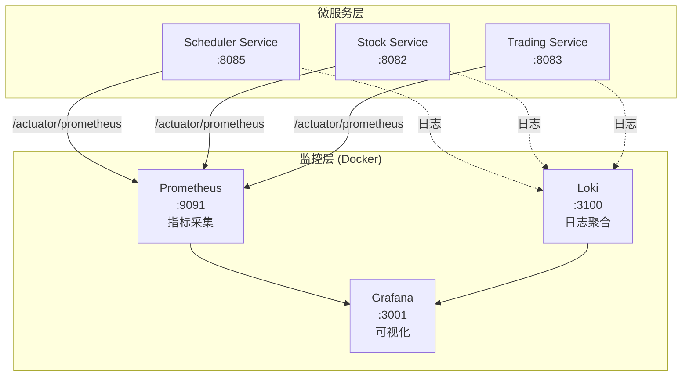

# 量化交易平台监控运维指南

## 📊 概述

本文档详细介绍量化交易平台的监控体系部署、配置和运维，包括 Prometheus、Grafana 和 Loki 的完整配置流程和常见问题排查。

## 🏗️ 监控架构



### 监控组件

| 组件 | 端口 | 用途 | 访问地址 |
|------|------|------|----------|
| **Prometheus** | 9091 | 时序数据库，指标采集 | http://localhost:9091 |
| **Grafana** | 3001 | 可视化监控面板 | http://localhost:3001 |
| **Loki** | 3100 | 日志聚合系统 | http://localhost:3100 |

## 🚀 快速启动

### 前置条件

```bash
✅ Docker 已安装并运行
✅ 至少一个微服务已启动（推荐先启动 Scheduler Service）
```

### 方法1：使用启动脚本（推荐）

```bash
# 从项目根目录执行
cd /Users/youweichen/quant-trading-platform
./start-monitoring.sh
```

### 方法2：手动启动

```bash
# 进入监控配置目录
cd infrastructure/monitoring

# 拉取最新镜像
docker compose -f docker-compose.monitoring.yml pull

# 启动所有监控服务
docker compose -f docker-compose.monitoring.yml up -d

# 查看启动状态
docker compose -f docker-compose.monitoring.yml ps
```

### 验证启动

```bash
# 检查 Prometheus
curl http://localhost:9091/-/healthy

# 检查 Grafana
curl http://localhost:3001/api/health

# 查看所有容器状态
docker ps | grep quant
```

预期输出：
```
quant-prometheus   Up   0.0.0.0:9091->9090/tcp
quant-grafana      Up   0.0.0.0:3001->3000/tcp
quant-loki         Up   0.0.0.0:3100->3100/tcp
```

## ⚙️ 配置详解

### 1. Prometheus 配置

**配置文件**：`infrastructure/prometheus/prometheus.yml`

```yaml
global:
  scrape_interval: 15s      # 每15秒采集一次指标
  evaluation_interval: 15s  # 每15秒评估一次告警规则

scrape_configs:
  # Scheduler Service 监控
  - job_name: 'scheduler-service'
    metrics_path: '/actuator/prometheus'
    static_configs:
      - targets: ['192.168.1.3:8085']  # 使用本机IP
        labels:
          service: 'scheduler'
          env: 'dev'

  # Trading Service 监控
  - job_name: 'trading-service'
    metrics_path: '/actuator/prometheus'
    static_configs:
      - targets: ['192.168.1.3:8083']
        labels:
          service: 'trading'
          env: 'dev'

  # Stock Service 监控
  - job_name: 'stock-service'
    metrics_path: '/actuator/prometheus'
    static_configs:
      - targets: ['192.168.1.3:8082']
        labels:
          service: 'stock'
          env: 'dev'
```

**⚠️ 重要提示**：
- **不要使用 `host.docker.internal`**，在 macOS Docker 中可能无法解析
- **使用本机实际 IP 地址**（通过 `ipconfig getifaddr en0` 获取）
- 修改配置后需重启：`docker compose -f docker-compose.monitoring.yml restart prometheus`

### 2. Grafana 配置

**数据源配置**：`infrastructure/grafana/provisioning/datasources/prometheus.yml`

```yaml
apiVersion: 1

datasources:
  - name: Prometheus
    type: prometheus
    access: proxy
    url: http://prometheus:9090  # Docker内部网络地址
    isDefault: true
    editable: true
    jsonData:
      timeInterval: 15s
```

**Dashboard 自动加载**：`infrastructure/grafana/provisioning/dashboards/dashboard-provider.yml`

```yaml
apiVersion: 1

providers:
  - name: 'Scheduler Dashboards'
    orgId: 1
    folder: 'Quant Platform'
    type: file
    disableDeletion: false
    updateIntervalSeconds: 10
    allowUiUpdates: true
    options:
      path: /var/lib/grafana/dashboards
```

**登录凭据**：
- 用户名：`admin`
- 密码：`admin123`

### 3. Docker Compose 配置

**配置文件**：`infrastructure/monitoring/docker-compose.monitoring.yml`

```yaml
version: '3.8'

services:
  prometheus:
    image: prom/prometheus:latest
    container_name: quant-prometheus
    ports:
      - "9091:9090"  # 避免与 ClashX 冲突
    volumes:
      - ../prometheus/prometheus.yml:/etc/prometheus/prometheus.yml
      - prometheus-data:/prometheus
    command:
      - '--config.file=/etc/prometheus/prometheus.yml'
      - '--storage.tsdb.retention.time=30d'  # 保留30天数据
    networks:
      - monitoring
    restart: unless-stopped

  grafana:
    image: grafana/grafana:latest
    container_name: quant-grafana
    ports:
      - "3001:3000"
    environment:
      - GF_SECURITY_ADMIN_USER=admin
      - GF_SECURITY_ADMIN_PASSWORD=admin123
      - GF_USERS_ALLOW_SIGN_UP=false
    volumes:
      - grafana-data:/var/lib/grafana
      - ../grafana/provisioning/dashboards:/etc/grafana/provisioning/dashboards
      - ../grafana/provisioning/datasources:/etc/grafana/provisioning/datasources
      - ../grafana/dashboards:/var/lib/grafana/dashboards
    networks:
      - monitoring
    restart: unless-stopped
    depends_on:
      - prometheus

  loki:
    image: grafana/loki:latest
    container_name: quant-loki
    ports:
      - "3100:3100"
    volumes:
      - ../loki/loki-config.yml:/etc/loki/local-config.yaml
      - loki-data:/loki
    command: -config.file=/etc/loki/local-config.yaml
    networks:
      - monitoring
    restart: unless-stopped

networks:
  monitoring:
    driver: bridge

volumes:
  prometheus-data:
  grafana-data:
  loki-data:
```

## 🔍 使用指南

### Prometheus 查询

访问 http://localhost:9091 并执行以下查询：

#### 1. 检查所有监控目标状态

```promql
up
```

返回值 `1` 表示服务正常，`0` 表示服务不可达。

#### 2. 查看 Scheduler Service 所有指标

```promql
{application="scheduler-service"}
```

#### 3. JVM 内存使用情况

```promql
jvm_memory_used_bytes{application="scheduler-service"}
```

#### 4. 价格更新总次数

```promql
scheduler_price_updates_total
```

#### 5. 成功率计算

```promql
(scheduler_price_updates_total - scheduler_price_updates_failed)
/ scheduler_price_updates_total * 100
```

#### 6. 每分钟更新速率

```promql
rate(scheduler_price_updates_total[1m])
```

#### 7. AI 热度分布

```promql
scheduler_ai_hotness_super_hot
scheduler_ai_hotness_hot
scheduler_ai_hotness_normal
scheduler_ai_hotness_cold
```

#### 8. 当前监控股票数

```promql
scheduler_monitored_stocks
```

### Grafana Dashboard

#### 导入预配置 Dashboard

1. 访问 http://localhost:3001
2. 使用 `admin/admin123` 登录
3. 点击左侧 **Dashboards** → **Import**
4. 选择文件：`infrastructure/grafana/dashboards/scheduler-monitor.json`
5. 选择数据源：**Prometheus**
6. 点击 **Import**

#### Dashboard 面板说明

| 面板名称 | 类型 | 指标 | 说明 |
|---------|------|------|------|
| 总更新次数 | Stat | `scheduler_price_updates_total` | 累计价格更新次数 |
| 成功率 | Gauge | `(成功/总数)×100` | 实时成功率，<95%告警 |
| 监控股票数 | Stat | `scheduler_monitored_stocks` | 当前监控的股票数量 |
| 更新频率 | Time Series | `rate(updates[1m])` | 每分钟更新趋势 |
| 失败率趋势 | Time Series | `rate(failed[5m])` | 失败率变化曲线 |
| 热度分布 | Pie Chart | `ai_hotness_*` | 各热度等级股票占比 |
| Top 10股票 | Table | `topk(10, update_count)` | 更新最频繁的股票 |
| 响应时间 | Graph | `duration_seconds` | 平均处理耗时 |
| 实时日志 | Logs | Loki | 服务日志流 |

## 🐛 故障排查

### 问题1：端口冲突（9090 被占用）

**现象**：
```bash
curl http://localhost:9090
# 返回: {"hello": "clash"}
```

**原因**：ClashX 代理占用了 9090 端口

**解决方法**：

方法A - 修改 Prometheus 端口（推荐）：
```yaml
# docker-compose.monitoring.yml
prometheus:
  ports:
    - "9091:9090"  # 改用9091端口
```

方法B - 关闭 ClashX 9090 端口：
```bash
# 在 ClashX 设置中修改外部控制器端口
```

### 问题2：Prometheus 无法采集指标

**现象**：
```promql
up{job="scheduler-service"}  # 返回空结果
```

**诊断步骤**：

1. **检查服务是否暴露指标**：
```bash
curl http://localhost:8085/actuator/prometheus
# 应返回大量指标数据
```

2. **检查 Prometheus targets 状态**：
访问 http://localhost:9091/targets
查看 scheduler-service 状态是否为 **UP**

3. **检查 Docker 网络连通性**：
```bash
docker exec quant-prometheus wget -qO- http://192.168.1.3:8085/actuator/prometheus
# 如果失败，说明网络不通
```

**常见原因及解决**：

#### 原因A：使用了 `host.docker.internal`

**错误配置**：
```yaml
targets: ['host.docker.internal:8085']
```

**解决方法**：
```bash
# 1. 获取本机IP
ipconfig getifaddr en0  # macOS
# 或
ip addr show | grep inet  # Linux

# 2. 修改 prometheus.yml
targets: ['192.168.1.3:8085']  # 使用实际IP

# 3. 重启 Prometheus
docker compose -f docker-compose.monitoring.yml restart prometheus
```

#### 原因B：防火墙阻止访问

```bash
# macOS - 允许端口
sudo /usr/libexec/ApplicationFirewall/socketfilterfw --add 8085

# Linux - 开放端口
sudo ufw allow 8085
```

#### 原因C：服务未启动

```bash
# 检查 Scheduler Service 是否运行
curl http://localhost:8085/actuator/health
# 应返回: {"status":"UP"}
```

### 问题3：Grafana Dashboard 显示 "No data"

**可能原因**：

1. **时间范围错误**
   - 解决：点击右上角时间选择器，改为 "Last 15 minutes"

2. **Prometheus 数据源未配置**
   - 解决：Settings → Data Sources → 添加 Prometheus

3. **查询语法错误**
   - 解决：检查 Panel 编辑页面的错误提示

4. **指标确实不存在**
   ```bash
   # 在 Prometheus 中验证指标是否存在
   curl -s "http://localhost:9091/api/v1/label/__name__/values" | grep scheduler
   ```

### 问题4：PromQL 语法错误

**错误示例**：
```promql
application="scheduler-service"  # ❌ 错误
```

**正确写法**：
```promql
{application="scheduler-service"}  # ✅ 正确
```

**常见错误**：

| 错误写法 | 正确写法 | 说明 |
|---------|---------|------|
| `application="xxx"` | `{application="xxx"}` | 缺少花括号 |
| `up{job='scheduler'}` | `up{job="scheduler"}` | PromQL使用双引号 |
| `rate(metric)` | `rate(metric[1m])` | rate需要时间窗口 |

### 问题5：Dashboard 自动加载失败

**现象**：重启 Grafana 后 Dashboard 未自动出现

**解决方法1 - 检查配置路径**：
```bash
# 验证文件结构
tree infrastructure/grafana/
# 应该看到：
# ├── dashboards/
# │   └── scheduler-monitor.json
# └── provisioning/
#     ├── dashboards/
#     │   └── dashboard-provider.yml
#     └── datasources/
#         └── prometheus.yml
```

**解决方法2 - 检查 Docker 卷挂载**：
```bash
# 进入容器检查
docker exec quant-grafana ls -la /etc/grafana/provisioning/dashboards
docker exec quant-grafana ls -la /var/lib/grafana/dashboards
```

**解决方法3 - 手动导入**：
1. Dashboards → Import
2. Upload JSON file
3. 选择 `scheduler-monitor.json`

## 📊 监控最佳实践

### 1. 告警配置建议

在 Grafana 中配置关键指标告警：

| 告警项 | 条件 | 持续时间 | 严重程度 |
|--------|------|----------|----------|
| 服务不可用 | `up == 0` | 1分钟 | 🔴 Critical |
| 成功率过低 | `success_rate < 95` | 5分钟 | 🟠 Warning |
| 响应时间过高 | `duration > 1s` | 5分钟 | 🟡 Info |
| 内存使用过高 | `memory > 80%` | 10分钟 | 🟠 Warning |

### 2. 数据保留策略

```yaml
# prometheus.yml
command:
  - '--storage.tsdb.retention.time=30d'  # 保留30天
  - '--storage.tsdb.retention.size=50GB'  # 或最大50GB
```

### 3. 性能优化

**减少采集频率**（如果数据量过大）：
```yaml
global:
  scrape_interval: 30s  # 从15s改为30s
```

**限制时间序列数**：
```yaml
command:
  - '--storage.tsdb.max-series=100000'
```

**使用 Recording Rules** 预计算常用查询：
```yaml
# prometheus-rules.yml
groups:
  - name: scheduler_rules
    interval: 30s
    rules:
      - record: scheduler:success_rate
        expr: (scheduler_price_updates_total - scheduler_price_updates_failed)
              / scheduler_price_updates_total * 100
```

### 4. 安全建议

1. **修改默认密码**：首次登录 Grafana 后立即修改
2. **启用 HTTPS**：生产环境配置 TLS 证书
3. **限制访问**：配置防火墙规则
4. **定期备份**：导出 Dashboard 和数据源配置

```bash
# 备份 Grafana 配置
docker exec quant-grafana grafana-cli admin export-dashboard > backup.json

# 备份 Prometheus 数据
docker cp quant-prometheus:/prometheus ./prometheus-backup
```

## 🧪 测试监控系统

使用提供的测试脚本：

```bash
cd /Users/youweichen/quant-trading-platform
./test-monitoring.sh
```

**测试内容**：
1. ✅ Prometheus 健康检查
2. ✅ Grafana API 连通性
3. ✅ Scheduler Service 状态
4. ✅ Prometheus 查询 API
5. ✅ 监控目标列表

**预期输出**：
```
🧪 Grafana监控系统测试脚本
================================

1️⃣ 测试Prometheus (端口9091)...
  ✅ Prometheus运行正常

2️⃣ 测试Grafana (端口3001)...
  ✅ Grafana运行正常

3️⃣ 检查Scheduler Service (端口8085)...
  ✅ Scheduler Service运行正常

4️⃣ 测试Prometheus查询API...
  ✅ Prometheus查询API工作正常

  📈 监控目标状态：
    scheduler-service: 🟢 UP
    trading-service: 🔴 DOWN
    stock-service: 🔴 DOWN
```

## 🔄 日常运维操作

### 启动监控栈

```bash
cd infrastructure/monitoring
docker compose -f docker-compose.monitoring.yml up -d
```

### 停止监控栈

```bash
docker compose -f docker-compose.monitoring.yml down
```

### 重启某个服务

```bash
# 重启 Prometheus
docker compose -f docker-compose.monitoring.yml restart prometheus

# 重启 Grafana
docker compose -f docker-compose.monitoring.yml restart grafana
```

### 查看日志

```bash
# 查看 Prometheus 日志
docker logs quant-prometheus -f

# 查看 Grafana 日志
docker logs quant-grafana -f

# 查看 Loki 日志
docker logs quant-loki -f
```

### 清理数据

```bash
# 停止服务
docker compose -f docker-compose.monitoring.yml down

# 删除持久化数据（谨慎操作！）
docker volume rm monitoring_prometheus-data
docker volume rm monitoring_grafana-data
docker volume rm monitoring_loki-data

# 重新启动
docker compose -f docker-compose.monitoring.yml up -d
```

### 更新配置

```bash
# 1. 修改配置文件
vim ../prometheus/prometheus.yml

# 2. 验证配置语法
docker exec quant-prometheus promtool check config /etc/prometheus/prometheus.yml

# 3. 热重载配置（无需重启）
curl -X POST http://localhost:9091/-/reload

# 或者重启服务
docker compose -f docker-compose.monitoring.yml restart prometheus
```

## 📚 相关文档

- [Scheduler Service 技术文档](./SCHEDULER_SERVICE.md) - 详细技术架构
- [Scheduler 快速上手](./SCHEDULER_QUICKSTART.md) - 5分钟入门
- [系统架构](./ARCHITECTURE.md) - 整体架构设计

## 🔗 快速访问

| 服务 | 地址 | 凭据 |
|------|------|------|
| Grafana | http://localhost:3001 | admin / admin123 |
| Prometheus | http://localhost:9091 | - |
| Loki | http://localhost:3100 | - |
| Scheduler Metrics | http://localhost:8085/actuator/prometheus | - |
| Scheduler Health | http://localhost:8085/actuator/health | - |

## 💡 常见问题 FAQ

### Q1: 为什么 Prometheus 端口是 9091 而不是默认的 9090？

A: 因为 ClashX 代理默认占用 9090 端口，为避免冲突改用 9091。

### Q2: 如何添加新的监控服务？

A: 编辑 `prometheus.yml` 添加新的 `scrape_config`：
```yaml
- job_name: 'new-service'
  metrics_path: '/actuator/prometheus'
  static_configs:
    - targets: ['192.168.1.3:8086']
```

### Q3: Dashboard 数据不刷新怎么办？

A: 检查右上角刷新间隔设置，建议设为 5s 或 10s。

### Q4: 如何导出 Grafana Dashboard？

A: Dashboard 页面 → Settings → JSON Model → Copy to Clipboard

### Q5: Prometheus 数据占用空间太大怎么办？

A: 减少保留时间或增加采集间隔：
```yaml
--storage.tsdb.retention.time=7d  # 改为7天
scrape_interval: 30s              # 改为30秒
```

---

**最后更新**: 2025-10-25
**维护者**: YC Tech Team
