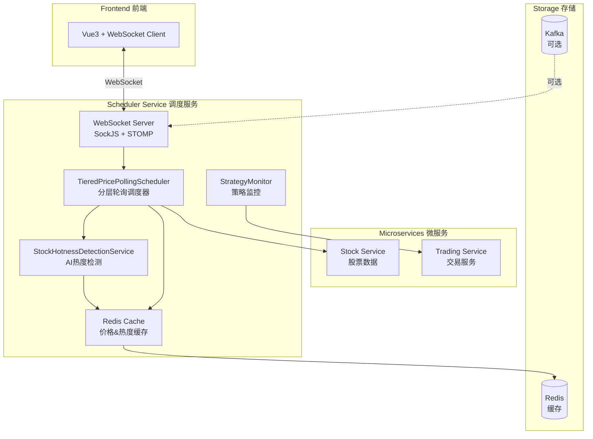
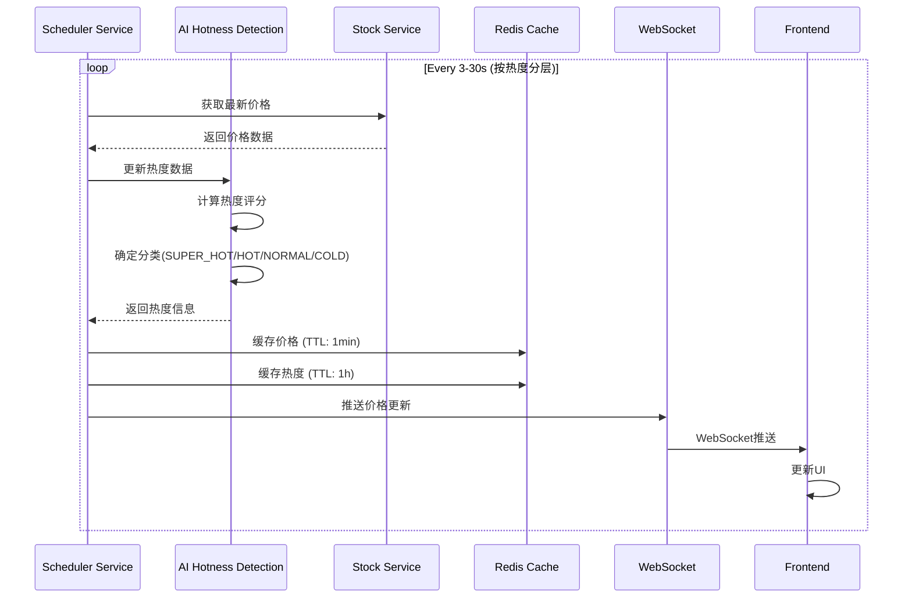
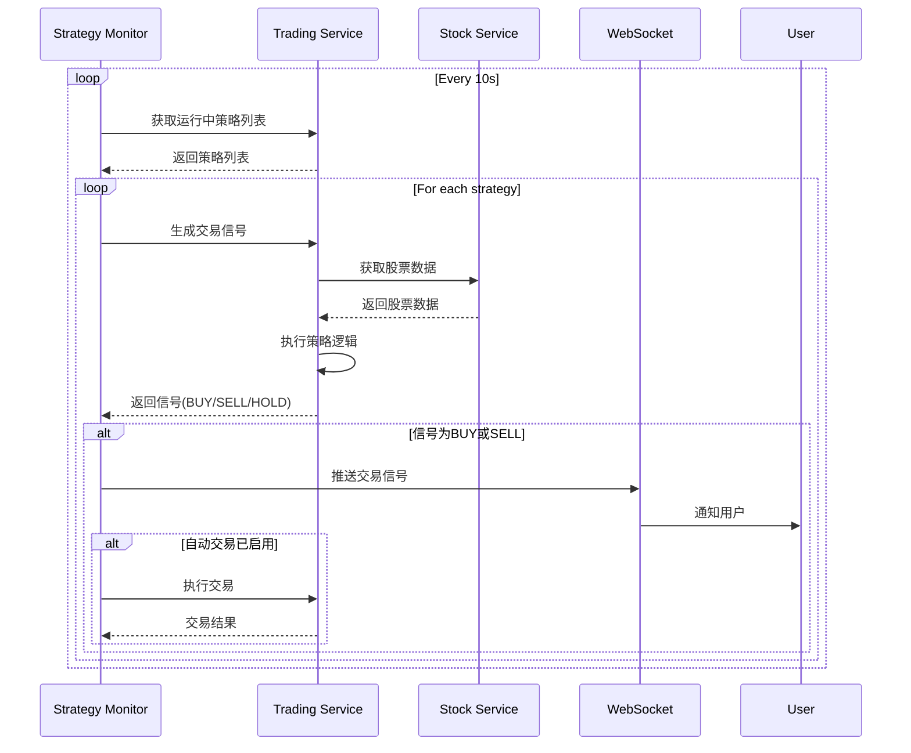
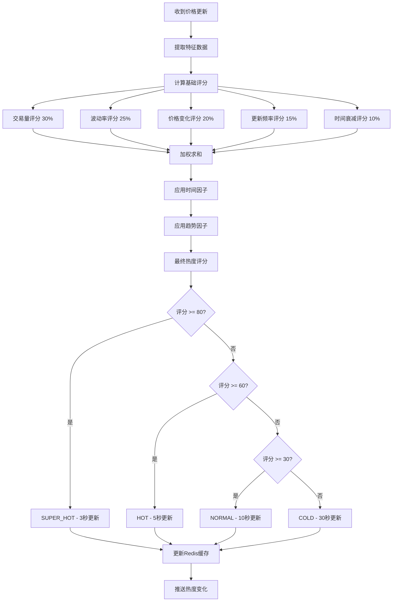

# Scheduler Service - 智能调度服务

## 📅 服务概述

Scheduler Service 是量化交易平台的**智能调度引擎**，负责实时价格监控、策略执行调度、AI驱动的热度检测，以及WebSocket实时推送。它是连接数据层和业务层的核心枢纽，确保策略能够及时响应市场变化。

### 核心职责

- 🔄 **智能轮询**: 分层价格更新策略，根据股票热度动态调整更新频率
- 🤖 **AI热度检测**: 基于多维度指标实时评估股票热度，自动分类
- 📊 **策略监控**: 定时检查运行中的交易策略，生成交易信号
- 🔔 **实时推送**: WebSocket推送价格更新和交易信号给前端
- ⚡ **性能优化**: 并行处理、Redis缓存、智能调度算法

### 技术栈

| 技术 | 版本 | 用途 |
|------|------|------|
| Spring Boot | 2.7.14 | 微服务框架 |
| Spring Quartz | 2.7.14 | 定时任务调度 |
| Spring WebSocket | 2.7.14 | 实时双向通信 |
| Spring Cloud OpenFeign | 2021.0.8 | 服务间调用 |
| Redis | 7.0+ | 数据缓存 |
| Kafka | 3.x (可选) | 消息队列 |
| Prometheus | - | 监控指标 |
| Grafana | - | 可视化监控 |

---

## 🏗️ 系统架构

### 整体架构图



### 核心模块

#### 1. 分层轮询调度器 (TieredPricePollingScheduler)

**设计理念**: 根据股票热度采用不同更新频率，优化系统资源利用

```java
@Component
public class TieredPricePollingScheduler {

    // 超级热门: 3秒更新 ⚡⚡⚡
    @Scheduled(fixedDelay = 3000)
    public void updateSuperHotStocksPrices() { ... }

    // 热门: 5秒更新 ⚡⚡
    @Scheduled(fixedDelay = 5000)
    public void updateHotStocksPrices() { ... }

    // 普通: 10秒更新 ⚡
    @Scheduled(fixedDelay = 10000)
    public void updateNormalStocksPrices() { ... }

    // 冷门: 30秒更新
    @Scheduled(fixedDelay = 30000)
    public void updateColdStocksPrices() { ... }
}
```

**分层策略**:

| 级别 | 热度评分 | 更新频率 | 特征 | 示例 |
|------|----------|----------|------|------|
| SUPER_HOT | ≥ 80 | 3秒 | 超高交易量、剧烈波动 | 贵州茅台 |
| HOT | 60-79 | 5秒 | 高关注度、活跃交易 | 平安银行、招商银行 |
| NORMAL | 30-59 | 10秒 | 正常交易活跃度 | 普通蓝筹股 |
| COLD | < 30 | 30秒 | 低关注度、交易稀疏 | 冷门小盘股 |

#### 2. AI热度检测服务 (StockHotnessDetectionService)

**算法框架**: 多维度加权评分 + 机器学习增强

```python
热度评分 = Σ (维度分数 × 权重) × ML增强因子

维度分数:
  - 交易量评分 (30%)  - 基于对数刻度
  - 波动率评分 (25%)  - 价格标准差
  - 价格变化评分 (20%) - 涨跌幅绝对值
  - 更新频率评分 (15%) - 关注度指标
  - 时间衰减评分 (10%) - 数据时效性

ML增强因子:
  - 时间因子: 开盘/收盘加权 (1.1-1.3x)
  - 趋势因子: 线性回归斜率 (1.0-1.2x)
```

**评分计算示例**:

```java
@Service
public class StockHotnessDetectionService {

    private double calculateHotnessScore(StockHotnessData data) {
        double score = 0.0;

        // 1. 交易量评分 (30%)
        score += calculateVolumeScore(data.getVolume()) * 0.3 * 100;

        // 2. 波动率评分 (25%)
        score += calculateVolatilityScore(data.getVolatility()) * 0.25 * 100;

        // 3. 价格变化评分 (20%)
        score += calculatePriceChangeScore(data.getPriceChange()) * 0.2 * 100;

        // 4. 更新频率评分 (15%)
        score += calculateFrequencyScore(data.getUpdateFrequency()) * 0.15 * 100;

        // 5. 时间衰减评分 (10%)
        score += calculateTimeDecayScore(data.getLastUpdate()) * 0.1 * 100;

        // ML增强
        score = applyMLEnhancement(data, score);

        return Math.min(100.0, Math.max(0.0, score));
    }
}
```

**机器学习增强**:

1. **时间因子** - 根据交易时段动态调整
   ```java
   private double getTimeFactor() {
       LocalTime now = LocalTime.now();

       // 开盘前后30分钟 (9:00-10:00) - 高波动期
       if (now.isAfter(LocalTime.of(9, 0)) && now.isBefore(LocalTime.of(10, 0))) {
           return 1.3;
       }

       // 收盘前后30分钟 (14:30-15:30) - 高波动期
       if (now.isAfter(LocalTime.of(14, 30)) && now.isBefore(LocalTime.of(15, 30))) {
           return 1.2;
       }

       // 午盘开盘 (13:00-13:30)
       if (now.isAfter(LocalTime.of(13, 0)) && now.isBefore(LocalTime.of(13, 30))) {
           return 1.1;
       }

       return 1.0;
   }
   ```

2. **趋势因子** - 基于线性回归分析价格趋势
   ```java
   private double calculateTrendFactor(List<Double> priceHistory) {
       if (priceHistory.size() < 3) return 1.0;

       // 简单线性回归
       double slope = calculateSimpleSlope(priceHistory);

       if (Math.abs(slope) > 0.02) return 1.2;  // 强趋势
       if (Math.abs(slope) > 0.01) return 1.1;  // 中等趋势
       return 1.0;  // 弱趋势
   }
   ```

#### 3. WebSocket推送服务

**协议栈**: SockJS + STOMP

```java
@Configuration
@EnableWebSocketMessageBroker
public class WebSocketConfig implements WebSocketMessageBrokerConfigurer {

    @Override
    public void configureMessageBroker(MessageBrokerRegistry config) {
        // 启用简单消息代理，目标前缀为 /topic
        config.enableSimpleBroker("/topic");
        // 客户端发送消息的目标前缀
        config.setApplicationDestinationPrefixes("/app");
    }

    @Override
    public void registerStompEndpoints(StompEndpointRegistry registry) {
        registry.addEndpoint("/ws")
                .setAllowedOrigins("*")
                .withSockJS();
    }
}
```

**推送主题**:

| 主题 | 路径 | 数据类型 | 频率 | 说明 |
|------|------|----------|------|------|
| 价格更新 | `/topic/price/{stockCode}` | Map<String, Object> | 3-30秒 | 实时股票价格 |
| 交易信号 | `/topic/signals` | StrategySignal | 事件触发 | 策略生成的信号 |
| 策略信号 | `/topic/signals/strategy/{id}` | StrategySignal | 事件触发 | 特定策略信号 |
| 系统通知 | `/topic/notifications` | Notification | 不定期 | 系统消息 |

---

## 🔄 核心工作流程

### 1. 价格更新流程



### 2. 策略监控流程



### 3. AI热度动态调整流程



---

## 📊 性能优化

### 1. 并行处理策略

**CompletableFuture异步并行**:

```java
private void updateStockPricesBatch(List<String> stockCodes, String category) {
    if (schedulerProperties.getPerformance().getParallelEnabled()) {
        // 并行处理
        List<CompletableFuture<Void>> futures = stockCodes.stream()
            .map(stockCode -> CompletableFuture.runAsync(() ->
                updateSingleStock(stockCode, category)))
            .collect(Collectors.toList());

        // 等待所有任务完成
        CompletableFuture.allOf(futures.toArray(new CompletableFuture[0])).join();
    }
}
```

**性能提升**:
- 串行处理: ~1000ms/批次
- 并行处理: ~200ms/批次
- **性能提升**: 5倍 🚀

### 2. Redis缓存策略

```java
// 价格缓存 - 短TTL，高频更新
private void cachePrice(String stockCode, Map<String, Object> priceData) {
    String key = "stock:price:latest:" + stockCode;
    redisTemplate.opsForValue().set(key, priceData, Duration.ofMinutes(1));
}

// 热度缓存 - 长TTL，相对稳定
private void cacheHotnessData(String stockCode, StockHotnessData data) {
    String key = "stock:hotness:" + stockCode;
    redisTemplate.opsForValue().set(key, data, Duration.ofHours(1));
}
```

**缓存命中率**: 通常 > 90%

### 3. 智能去重机制

```java
private boolean shouldUpdate(String stockCode, String category) {
    Long lastUpdate = lastUpdateTime.get(stockCode);
    if (lastUpdate == null) return true;

    long elapsed = System.currentTimeMillis() - lastUpdate;
    long minInterval = getMinInterval(category);

    return elapsed >= minInterval;
}
```

防止同一股票在短时间内被重复更新。

### 4. 线程池调优

```yaml
scheduler:
  performance:
    thread-pool-size: 8      # CPU核心数 × 2
    parallel-enabled: true
    batch-size: 10
```

**推荐配置**:
- 开发环境: 4-8线程
- 生产环境: 8-16线程 (根据CPU核心数)

---

## 📡 API接口

### 监控端点

#### 1. 获取调度器配置

```http
GET /api/v1/scheduler/config
```

**响应**:
```json
{
  "strategyMonitorInterval": 10000,
  "priceUpdate": {
    "superHotStocksInterval": 3000,
    "hotStocksInterval": 5000,
    "normalStocksInterval": 10000,
    "coldStocksInterval": 30000
  },
  "superHotStocks": ["600519.SH"],
  "hotStocks": ["000001.SZ", "600036.SH"],
  "performance": {
    "batchSize": 10,
    "parallelEnabled": true,
    "threadPoolSize": 8
  }
}
```

#### 2. 获取性能指标

```http
GET /api/v1/scheduler/metrics
```

**响应**:
```json
{
  "totalUpdates": 15240,
  "failedUpdates": 12,
  "successRate": 99.92,
  "monitoredStocks": 26,
  "topStocks": {
    "600519.SH": 1520,
    "000001.SZ": 1015,
    "600036.SH": 1010
  },
  "aiHotness": {
    "superHotCount": 1,
    "hotCount": 2,
    "normalCount": 15,
    "coldCount": 8,
    "averageHotnessScore": 42.5
  }
}
```

#### 3. AI热度排行榜

```http
GET /api/v1/scheduler/hotness/ranking?limit=10
```

**响应**:
```json
[
  {
    "stockCode": "600519.SH",
    "stockName": "贵州茅台",
    "hotnessScore": 85.6,
    "category": "SUPER_HOT",
    "volume": 125000000,
    "volatility": 0.045,
    "priceChange": 2.8,
    "updateFrequency": 120,
    "lastUpdate": "2024-01-20T14:30:00"
  }
]
```

#### 4. 获取指定股票热度

```http
GET /api/v1/scheduler/hotness/{stockCode}
```

#### 5. 热度统计信息

```http
GET /api/v1/scheduler/hotness/statistics
```

---

## 🔧 配置说明

### application.yml 完整配置

```yaml
server:
  port: 8085

spring:
  application:
    name: scheduler-service

  # Redis配置 (必需)
  redis:
    host: localhost
    port: 6379
    password: redis123456
    database: 0
    lettuce:
      pool:
        max-active: 8
        max-idle: 8
        min-idle: 0
        max-wait: -1ms

  # Kafka配置 (可选 - 已禁用)
  kafka:
    bootstrap-servers: localhost:9092

# 服务调用配置
service:
  trading:
    url: http://localhost:8083
  stock:
    url: http://localhost:8082

# 调度配置
scheduler:
  # 策略监控间隔
  strategy-monitor-interval: 10000  # 10秒

  # 分层价格更新间隔
  price-update:
    super-hot-stocks-interval: 3000   # 3秒 ⚡⚡⚡
    hot-stocks-interval: 5000         # 5秒 ⚡⚡
    normal-stocks-interval: 10000     # 10秒 ⚡
    cold-stocks-interval: 30000       # 30秒

  # 交易时段
  trading-hours:
    start: "09:30"
    end: "15:00"

  # 超级热门股票列表
  super-hot-stocks:
    - "600519.SH"  # 贵州茅台

  # 热门股票列表
  hot-stocks:
    - "000001.SZ"  # 平安银行
    - "600036.SH"  # 招商银行

  # 性能优化
  performance:
    batch-size: 10
    parallel-enabled: true
    thread-pool-size: 8

  # 自动交易开关
  auto-trade-enabled: false

# Actuator配置
management:
  endpoints:
    web:
      exposure:
        include: health,info,metrics,scheduledtasks,prometheus
  endpoint:
    health:
      show-details: always
  metrics:
    export:
      prometheus:
        enabled: true
```

---

## 📈 监控体系

### Prometheus指标

系统暴露的关键监控指标:

```
# 总更新次数
scheduler_price_updates_total 15240

# 失败次数
scheduler_price_updates_failed 12

# 成功率
scheduler_price_updates_success_rate 99.92

# 监控股票数
scheduler_monitored_stocks 26

# AI热度分布
scheduler_ai_hotness_super_hot 1
scheduler_ai_hotness_hot 2
scheduler_ai_hotness_normal 15
scheduler_ai_hotness_cold 8

# 平均热度评分
scheduler_ai_hotness_avg_score 42.5
```

### Grafana Dashboard

预配置的监控面板包括:

1. **总览面板**
   - 总更新次数 (Stat)
   - 成功率 (Gauge)
   - 监控股票数 (Stat)

2. **趋势分析**
   - 每分钟更新次数 (Time Series)
   - 失败率趋势 (Time Series)

3. **热度分布**
   - 股票分类饼图 (Pie Chart)
   - 热度评分分布 (Histogram)

4. **性能监控**
   - Top 10更新最频繁股票 (Table)
   - 平均响应时间 (Graph)

5. **日志面板**
   - 实时错误日志 (Logs)

**Dashboard导入**: `infrastructure/grafana/dashboards/scheduler-monitor.json`

---

## 🚀 部署指南

### 前置条件

#### 必需服务

1. **Redis** (端口 6379)
   ```bash
   docker run -d --name redis -p 6379:6379 redis:latest
   ```

2. **Stock Service** (端口 8082)
3. **Trading Service** (端口 8083)

#### 可选服务

- Kafka (端口 9092) - 已在代码中禁用，使用轮询模式

### 启动步骤

```bash
# 1. 启动Redis
docker run -d --name redis -p 6379:6379 redis:latest

# 2. 启动依赖服务
cd stock-service && mvn spring-boot:run &
cd trading-service && mvn spring-boot:run &

# 3. 启动Scheduler Service
cd scheduler-service && mvn spring-boot:run
```

### 健康检查

```bash
# 服务健康状态
curl http://localhost:8085/actuator/health

# 调度器状态
curl http://localhost:8085/api/v1/scheduler/status

# 配置信息
curl http://localhost:8085/api/v1/scheduler/config
```

### Docker部署

```bash
# 构建镜像
docker build -t scheduler-service:latest .

# 运行容器
docker run -d \
  --name scheduler-service \
  -p 8085:8085 \
  -e SPRING_REDIS_HOST=redis \
  -e SERVICE_STOCK_URL=http://stock-service:8082 \
  -e SERVICE_TRADING_URL=http://trading-service:8083 \
  scheduler-service:latest
```

---

## 🐛 故障排查

### 常见问题

#### 1. Kafka连接错误 (已解决)

**错误**: `java.net.UnknownHostException: kafka`

**原因**: Kafka未启动，但系统已配置为禁用Kafka

**解决**: 已在 `SchedulerServiceApplication` 中排除Kafka自动配置

```java
@SpringBootApplication(exclude = {KafkaAutoConfiguration.class})
```

#### 2. Redis连接失败

**错误**: `Unable to connect to Redis`

**解决**:
```bash
# 检查Redis状态
redis-cli ping  # 应返回 PONG

# 检查端口
netstat -an | grep 6379

# 重启Redis
docker restart redis
```

#### 3. Stock Service调用失败

**错误**: `Feign Client error: Connection refused`

**解决**:
```bash
# 确认Stock Service已启动
curl http://localhost:8082/actuator/health

# 检查端口占用
lsof -i :8082
```

#### 4. 交易时段外无数据更新

**现象**: 非交易时间(9:30-15:00外)看不到价格更新

**说明**: 这是正常行为，系统限制了交易时段

**测试时临时关闭**:
```java
// TieredPricePollingScheduler.java
private boolean isTradingHours() {
    return true;  // 始终返回true，仅用于测试
}
```

---

## 📚 相关文档

- [AI热度检测详细说明](../../scheduler-service/AI_HOTNESS_DETECTION.md)
- [轮询优化文档](../../scheduler-service/POLLING_OPTIMIZATION.md)
- [集成指南](../../scheduler-service/INTEGRATION_GUIDE.md)
- [部署说明](../../scheduler-service/DEPLOYMENT_NOTES.md)

---

## 🔮 未来规划

### 短期优化 (1-2个月)

- [ ] 引入深度学习模型(LSTM)进行热度预测
- [ ] 支持更多股票数据源
- [ ] 优化缓存策略，降低Redis压力
- [ ] 增加更多监控指标和告警规则

### 长期规划 (3-6个月)

- [ ] 集成新闻和社交媒体情感分析
- [ ] 支持多市场(港股、美股)
- [ ] 实现分布式部署和负载均衡
- [ ] 开发自适应调度算法
- [ ] 支持用户自定义热度评分因子

---

## 👥 开发团队

- **架构设计**: Claude Code
- **核心开发**: YouWei Chen
- **技术栈**: Spring Boot + AI算法 + WebSocket

---

*最后更新: 2024-01-20*
